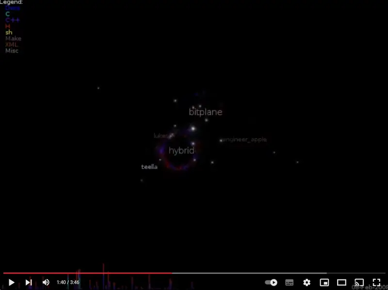

# code_swarm

I’ve been playing with code_swarm and made this video of the Irrlicht Engine’s
development history:

Since the video is generated from the SVN version history it starts at the point
where Niko gave hybrid and I SVN access (June 2006), so misses out years of
development leading up to the 1.0 release.

code_swarm is a really cool tool, one thing which is exciting is the fact it
supports MediaWiki. It would be really nice to show a small wiki coming
together.. or maybe one day Wikipedia’s entire changelog (we can dream!)
