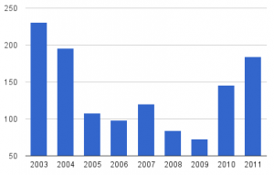
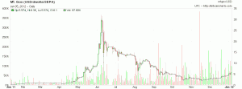
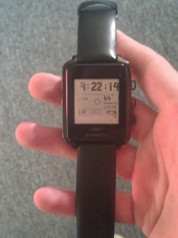

# 2011 in review

Dear diary

Sorry for not writing to you of late, but this year has been a busy one. I’ll
make up for my lack of output with this mammoth post reviewing a small selection
of interesting things I got up to this year...

## Did far too much work

Feels like I’ve been busting my balls for the last two years, so I decided to
stick all my invoices into Google Docs and graph the output. The answer is yes,
I’ve been working like a full-time employee.

I love consulting and Microsoft have a great working environment, but a rolling
contract at a huge corporation means living out of a hotel for months at a time,
which gets old rather fast. I learned a lot about BizTalk, Visual Studio Load
Test and T-SQL, I’ll miss the new friends I’ve made, but I certainly won’t miss
the travel. So I’m taking a couple of months off to doss around, learn some new
technologies and work on some free software before looking for another contract.

## Rediscovered Bitcoin during the bubble

I initially flirted with Bitcoin in late 2010 and was completely fascinated by
the idea of a P2P currency, specially the proof-of-work method and the
anonymity. There was no GPU mining software available and doing work units on
the CPU had pretty low returns, but in December I decided to get a decent PC for
experimenting with this new currency. After a bunch of cooling problems and
losing my wallet.dat (containing a mere 5 BTC, worth about 30 US cents each; £1
total at the time) I fell out of love with Bitcoin and forgot all about it...

Fast forward 6 months and everyone is talking about this amazing new currency,
demand outstrips supply, prices soar and the bubble finally bursts at $28 a
piece. Why, oh why did I spend £2,000 on a top of the range computer then not
even bother mining any BTC, rather than £1000 on BTC in December and sell out at
£95,0000 in June?

On top of the new PC the Bitcoin thing ended up costing me about £50 in
electricity, and my ATI 5970 hasn’t been feeling well since. I did play online
poker with Americans after they closed all the poker sites, and made about $200
trading on Mt Gox. Not enough BTC to have someone assassinated but the option to
buy 5 wraps of heroin from Silk Road is always open (INSTANT ADDICTION, TORE
FAMILY APART. A++++ WOULD BUY AGAIN)

## Read Gödel, Escher, Bach

With all the travel I’ve had a fair bit of time for reading, which is nice.
Along with The Design of Everyday Things and Zen and the art of Motorcycle
Maintenance, Godel, Escher, Bach (that’s Girdle, Esher, Bark to us infidels)
changed the way that I think about a lot of things.

This year I’m going to try to set more time aside for reading.

## Got into home brewing

A few months back I decided to start brewing mead, yeah, *before* Skyrim came
out. I’m now seven batches in and I think I’m getting the hang of it, my latest
batches taste a bit less like sweaty feet and a bit more like something you
might want to drink. I started out using a 5L bottle of water with 3 jars of
honey, some raisins and bread yeast added to it and a balloon stuck over the
top, and now I’ve progressed to demijohns with real air-locks and exotic
ingredients like.. uh.. orange flesh, cloves and vanilla pods. I even made some
labels:

I figure that this whole home brewing thing is a long game, it’s worth starting
while I’m in my 30s if I’m going to actually master it before I’m old and grey.
That is if the state of the kitchen doesn’t cause me to die of death by angry
woman first.

## Replaced my MBW-150

After the LEDs burned out on my Sony Ericsson MBW-150 I replaced it with a shiny
new [Metawatch](https://web.archive.org/web/20161020070619/http://www.metawatch.org/).
Apparently it looks like a cheap, tacky Casio (so some random guy in a bar tells
me anyway), but it’s not really supposed to be bling; the firmware and Android
software is open source, making the device infinitely programmable.

The down-side is that the firmware is too large to be compiled using gcc for
MSP430, so there’s currently no free development environment. I sketched out an
analogue face for it in C, but if I wanted to spend £2000 on an analogue watch
face then I would have got a Rolex instead!

## Neglected Free Software

I’ve been lazy when it comes to developing this year. I’ve done no work on my
Android apps, pushed a single commit to Irrlicht and wrote about 100 lines of my
[web-based VNC client](https://canvnc.sf.net/). I feel like I’ve cheated on the
world by spending most of the year writing T-SQL and C# for Microsoft, so my new
year’s resolution is to get off my backside and write some code.

And blog more. Yeah, I’ll do that too.
