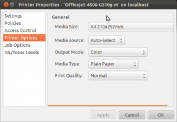
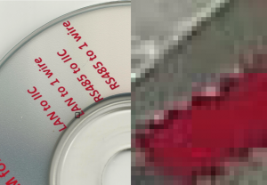

# Ubuntu printing and scanning

I haven’t owned a printer since I had an Amiga all those years ago, but since
I’ve started my homebrew mission I’ve decided I need something to print some
labels. Kath got me a HP OfficeJet 4500 G510g printer/scanner/copier for my
birthday, and I have to say it works wonderfully.

My last experience with a printer in Ubuntu was when I attempted to use an old
Lexmark Z-something, there were no Linux drivers and after much struggling I had
to reboot into Windows to use it. The Windows drivers were close to a hundred
megabytes, sluggish, always running and came complete with an intrusive systray
app to further sap system resources. The app had a non-standard and ugly UI plus
annoying American voice that begged me to “please insert paper in the auto
sheet-feeder” each time I tried to print something. I remember Canon doing a
similar thing with their Windows software too which is one reason why I’ve
avoided printers for all these years. That sort of blatant disregard for system
resources and desktop space makes the overhead of attaching a printer weigh in
heavier than the reward it offers.

I don’t know whether it’s HP’s, Canonical’s or Debian’s idea but the experience
with my OfficeJet 4500 in Ubuntu has been great. Rather than having to download
drivers I just plugged it in. I installed gLabels from the Software Center and
printed out some labels within minutes. Pressing meta and typing “print” takes
me to Gnome’s Printing app which lists my printer and its fax machine
counterpart (remember those?!), and I can right click and set quality settings
and so on in a standard UI:

Keying “scan” into Unity’s search bar takes me to Canonical’s “Simple Scan”
which really is as easy as π, it just scans. Before I could scan through Gimp I
had to install XSane, which a bit of a mess. It opens four windows and somehow
transfers to Gimp as JPEG by default, leaving 16×16 JPEG compression artefacts
in my scanned images. These look bad even if I choose 100% quality in the menu,
so it looks like the quality settings are ignored:

edit: A bit of investigation showed that this is due to Sane’s XP driver using
10% JPEG compression by default. This can be disabled via the Window -> Show
advanced options dialog.
