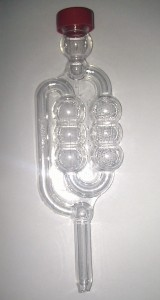
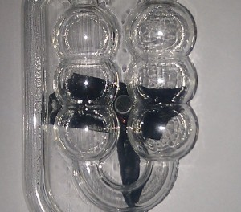
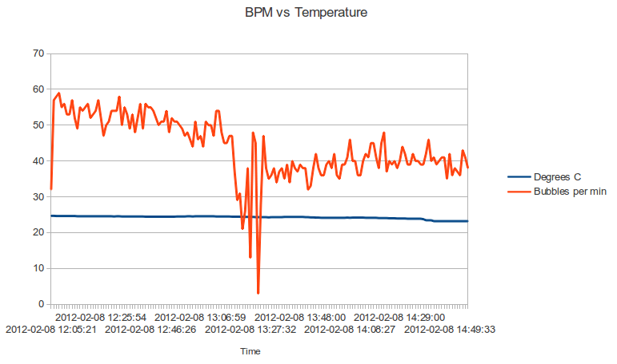

# Bubbler: Monitoring homebrew CO2 production with arecord and Python

A couple of weeks back I was thinking about monitors and sensors and had a crazy
idea: it ought to be possible to gather stats on how well my plonk is fermenting
by attaching a mic to the airlock and counting the bubbles. So in a moment of
enthusiasm I ordered a cheap lapel microphone from eBay and forgot all about
it... until Saturday morning when it finally arrived in the post.

Time for some fun!

The first thing I did was break the plastic housing off the mic and exposed the
sensor, I snipped off the headphone socket and taped up the rest. It’s not the
prettiest bit of electrical tape you’re likely to see, but it does the job:

 

I then taped the mic to the airlock roughly at the area where the bubbles will
be, then taped the whole thing up to make it a bit more water-resistant.

 

Okay, now onto the fun bit: writing the software :)

The easiest way to get sound from the mic port is to use ALSA‘s arecord, which
comes as part of
[alsa-utils](https://web.archive.org/web/20161020123019/http://www.alsa-project.org/main/index.php/Download)
and should already be installed on your distro. Run amixer from the command line
to find the correct input and unmute it if required, but in most cases just
running arecord will work. I set my volume levels to be 100% (unamplified) as I
want to be the only person messing with the data.

I’m after a raw stream of data without any of that WAV header nonsense, so
throwing a stream of raw longs to stdout looks a little like this:

```shell
gaz@beast:~$ arecord --format=S32_LE --file-type=raw
```

The next task is detecting the bubbles in this raw data. The mic is touching the
airlock so the bubbles are very loud and high pitched, so plugging in a high
pass filter might help get rid of any background noise. I found that using
Audacity’s high pass filter managed to keep the bubble track intact while
filtering out most of the the sound of a vacuum cleaner, which is pretty
impressive. I didn’t write my own high pass filter as it seems to work okay
without one, maybe I’ll make an FFT-based one in the future.

For the moment though, I simply defined a bubble-part as a volume reading that
is two standard deviations away from the mean, where the mean is taken by
summing the distance of each sample from the base line; waves always add up to
0, so we need an absolute measurement from the base line or the average will
always be 0. If this bubble part is more than t milliseconds from the last one,
then we have a new bubble.

My limited testing shows that the bubble count appears to be roughly right even
when I’m playing music in the background, but it will probably need some tweaks
before it works in all cases. So far it’s only been tested with my 25 litre
plastic wine fermenter, so I have no idea how it will perform on demijohns. I
can think of a number of things that are wrong with the algorithm too.

For a start it’s adaptive, so if you simply unplug the cable then the odd
bubble will be detected. A minimum bubble length may help here. Secondly, the
averages are taken from the last listening period so it’s all dependent on the
length of this window, moving averages might be better, but would be more
processor intensive (as if Python wasn’t processor intensive enough) and I have
no idea what that does statistically, but I imagine it’s not good from a purist
perspective. Finally, it’s using average volume of each |sample value| but it
actually uses peak levels to detect bubbles, so I guess that it ought to be
using the maximum |sample value| over N samples where N is equivalent to some
minimum frequency.

Ignoring all that it appears to work okay. Here’s a graph that shows it in
action along with my [thermometer](../../01/temper1-ubuntu), the dip is caused
by me dismantling it while taking the photos above.



You can download or fork the the code over on
[github](https://github.com/bitplane/bubbler).

Happy brewing!
