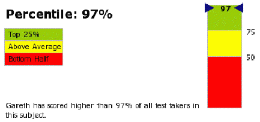

# On software aptitude tests

Last Monday I decided to pull out all the stops and actually get a job, meaning
stop playing Minecraft, update my CV and pass it to a dozen or so agencies who
appear to exist for the sole purpose of creaming money off the top of my daily
rate. By Wednesday I had an interview lined up with a client, providing I pass a
Loadrunner exam provided by IKM Europe. Sounds like fun… let’s do this!

After four multiple-choice “which menu is this option in?” questions I’d
cancelled the test in a rage and was on the phone to the agency explaining that
I was genuinely offended that they’d rank their applicants using quantitative
measures of memory when the required skill-set is essentially qualitative and
down to problem solving. Ten minutes later I was sat pink-bottomed, my neck
wound in, reluctantly plodding through the rest of the questions.

You’re a Windows expert right? Without looking, what’s the second item up after
pressing the start button on a Windows XP machine? Okay, Linux, what’s the `-s`
in `ls -s`?

I think I counted two questions about systems diagnostics, one on paging and one
on bandwidth, which would actually judge a candidate’s ability to solve
problems, but the rest were about installation, process names and menu items.
Along with the menu questions I was expected to know whether the first parameter
to sprintf was the formatting or the destination string, the difference between
`%09ld` and `%9ld`, that LoadRunner uses `strftime` and which token means
abbreviated month name. Surely a smart person would press the F1 key every time
rather than learning C’s escape sequence mess off-by-heart.

How a score of 76 out of 100, a B+ at best, puts someone over two standard
deviations from the mean is anyone’s guess. Either most people are rubbish or
the test is measuring the wrong things. I suspect it’s a combination of both,
but more of the latter than the former.

Good job it didn’t measure punctuality and work ethic or I’d have been jobless
in the bottom quartile, spending tomorrow morning in my dressing gown with a
beard instead of suited and booted in a bank. Do razors come with an instruction
manual? It’s been a while...
