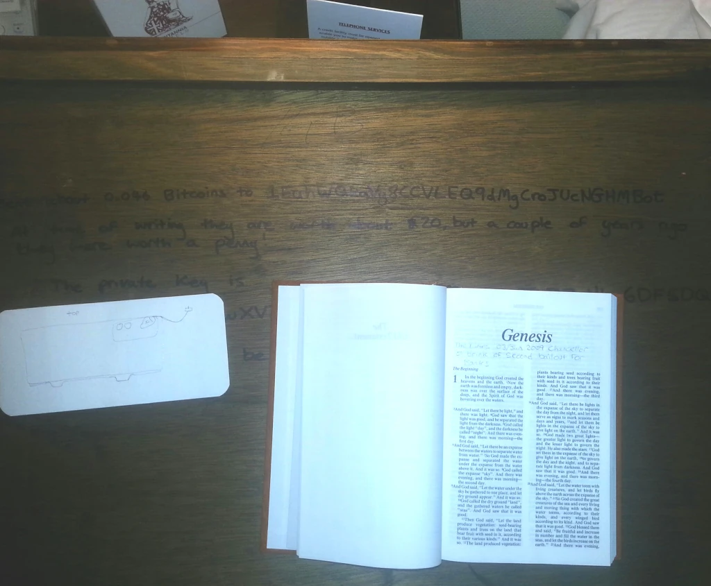

# A bitcoin treasure hunt

On this day I sent £20 to a Bitcoin wallet, wrote the private key to the
underside of a drawer in a hotel room. I left a clue in the room's Gideons
bile (in pencil, I'm not an animal), and bookmarked it with another clue.

As of November 2024, it's unclaimed and has a value of, well look for
yourself:
  [1EuhWQkaVg8CCVLEQ9dMgCroJUcNGHMBot](https://www.blockchain.com/explorer/addresses/btc/1EuhWQkaVg8CCVLEQ9dMgCroJUcNGHMBot)

