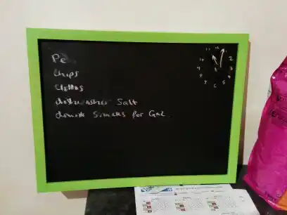
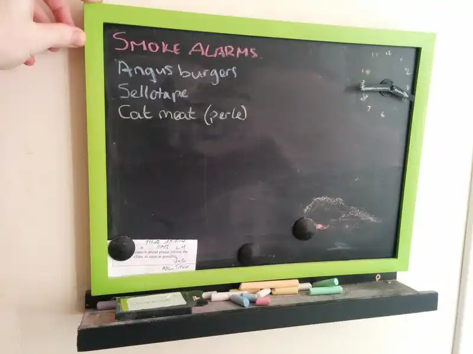

# 🕑 blackboard clock

A bit of fun. Kath and I had some blackboard paint and some rolls of blackboard
paper, and plenty of chalk. So after a couple of attempts, made this thing out
of a cheap whiteboard, 

* 🧲 The back is metal, so it's magnetic
* ⏱️ The clock hands are painted with blackboard paint, and have been drawn back
  on in chalk, so they look like they're hand-drawn.
* ✏️ We made a wooden tray to put the chalk in. 
* 🗑 Downsides: it gets a bit messy after a while, and it's a bit small.

|  |  |

