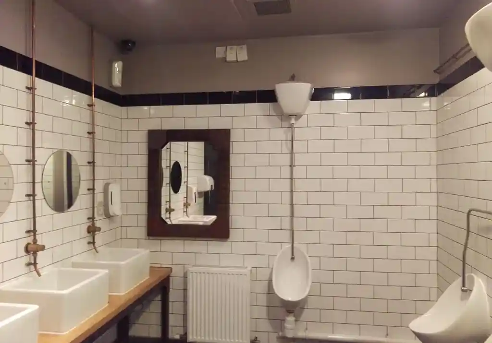
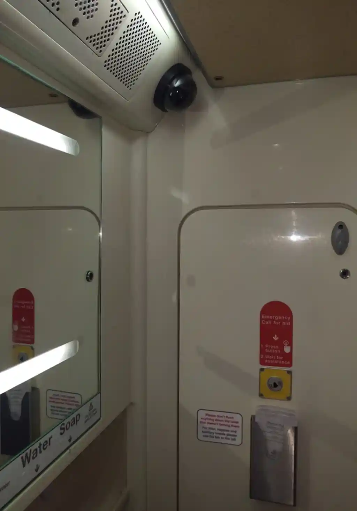
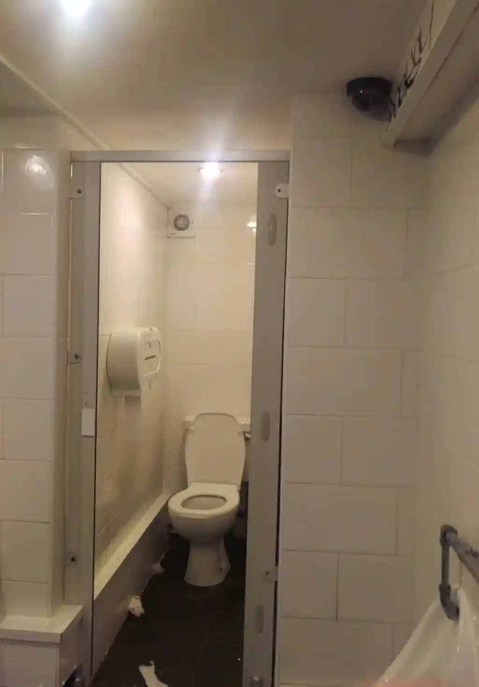

# 📷 Trollcam

CCTV is everywhere, in too many places. Makes you wonder if people would even
object to it if there was CCTV in toilets.

Part performance art, part political statement, part experiment, I got some
empty camera domes from AliExpress and put them in inappropriate places.

Sadly, nobody ever noticed apart from the staff. Years later, they actually
started appearing in real toilets.

Here's the best 3:

<table><tr>
<td></td>
<td></td>
</tr></table>

