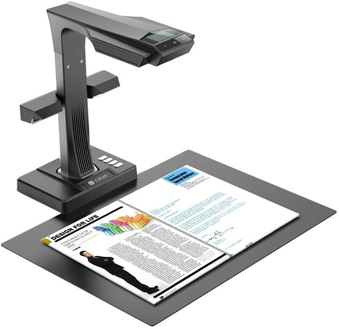

# 📚 CZUR ET16 Plus book scanner

I got one of these:

## How it works

Software is Windows only, which is a shitter. But you open it and create a new
project, which is essentially a folder that gets filled with JPGs.

Then you place the book on the mat, hold the pages open with these things that
that they call "thumb cots". These fit on your thumbs and mark the left and
right edges of the page using ARToolKit markers.

Then you push the foot pedal, and it takes two pictures. As it takes the first
one it beams a red laser out which captures the curvature of the page, then it
takes a second one to capture the content.

Then using the markers and curvature info, it unwarps the pages so they're flat.

Once you get the rhythm right it about 2 seconds per page, so you can scan a 300
page book in about 10 minutes.

When you're done, you export the project. This uses Abbyy to do the OCR and
takes another 5-10 minutes. You end up with a searchable PDF file with great
compression levels - a couple of megabytes a book.

All in all a great tool, and while I won't admit to exactly which things I've
scanned, archive.org, Library Genesis and private eBook torrent trackers have
grown to include interesting books that I've found in second hand book shops
over the years.
