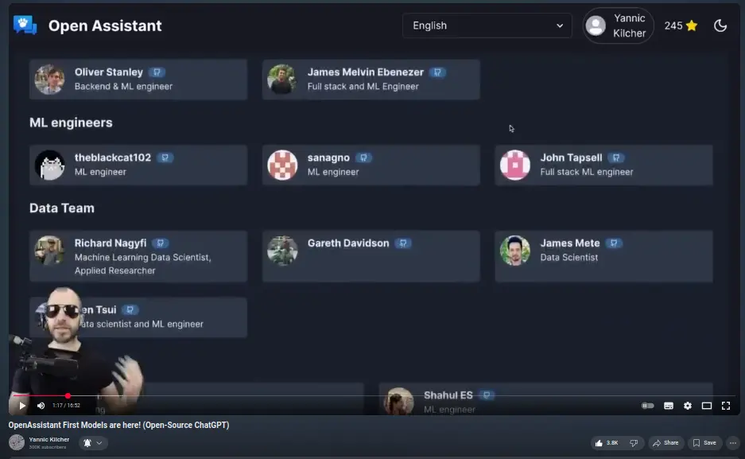

# 🤖 Open Assistant trained

The time spent herding cats, reviewing PRs, squashing bugs and doing data entry
on the OASST data collection platform finally paid off; LAION have a model
that's trained on the data. So ChatGPT for everyone!

Got my name in one of Yannic's videos too, which is nice:

15 minutes of fame are over. Get back to the code mills!
