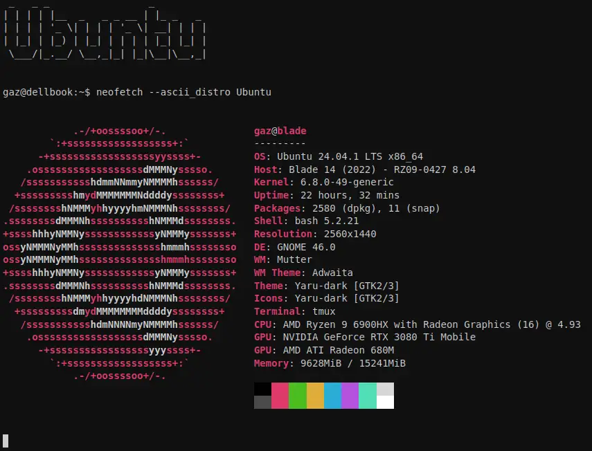

# 🎥 All the neofetch distros

So, made a video of all the neofetch distros. I put it on YouTube at the
time, but now I've got a `asciinema` feature I may as well use it!

* [🐱 github](https://github.com/bitplane/neofetch-ascii-show)
