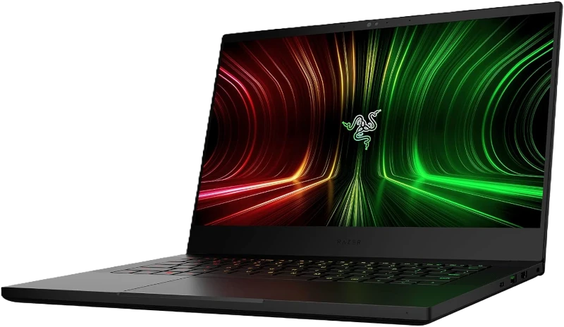

# New laptop

Got a new laptop 'cause my old XPS-13 has a dead battery and the charger. It's
the
[2023 Razer Blade 14](https://www.amazon.co.uk/Razer-Blade-14-Display-Windows/dp/B09Q6D7H7V).

Specs:

| ?               | =                                                           |
|-----------------|-------------------------------------------------------------|
| **Display**     | 14" IPS, 2560 x 1440, 165Hz                                 |
| **CPU**         | AMD Ryzen 9 5900HX                                          |
| **GPU**         | NVIDIA GeForce RTX 3080 16GB GDDR6 VRAM                     |
| **Memory**      | 16GB DDR4 3200MHz (soldered)                                |
| **Storage**     | 1TB PCIe Gen 3 NVMe SSD                                     |
| **Build**       | Machined aluminum body, black paint                         |
| **Ports**       | 2 x USB-A 3.2 Gen 2, 2 x USB-C 3.2 Gen 2 (PD), 1 x HDMI 2.1 |
| **Keyboard**    | Compact, RGB backlighting                                   |
| **Trackpad**    | Large, glass surface, precision touchpad                    |
| **Battery**     | 61.6 Wh, "up to 12 hours of battery life"                   |
| **Weight**      | 1.78 kg                                                     |
| **Dimensions**  | 319.7 x 220 x 16.8 mm                                       |
| **PSU**         | 230W power brick, supports USB-C PD charging (up to 100W)   |

## Thoughts

* Windows 11 is *okay*, it's not great, but it's not bad either.
  That said I'll get Linux running on it ASAP.
* Battery life isn't great compared to the M1 Mac I've been using for work.
  But it is a bit of a monster and I've most spent time installing stuff, so
  it might get better.
* Charger port is on the wrong side as usual, but thankfully it supports USB PD
  as well as the chunky charger, so I can charge it with the client's Mac
  charger (like my phone, vape, Switch, headset, e-reader etc).
* Keyboard has a nice feel. On par with the MacBook Pro, better than Dell XPS.
  I think it was Acer that had the best keyboard feel when I tested them last.
  Lights on it mean I can't see the symbols, which is the only time I look at
  the keyboard (switching between Mac and PC - grr).
* The screen is high enough quality but still not great for working in the
  garden.
* 16GB of RAM maximum seems a bit limiting, but 16GB of GPU RAM is liberating.
  Not that the 32GB I had on my XPS was ever used, it'd slow to a crawl long
  before I'd filled it.
* Cooling seems to be better than the XPS. Well, anything is better than Dell's
  cooling. It's not that loud, but it does get toasty.
  There's time for the fans to get clogged up yet, so time will tell.
* PassMark score was pretty good:
  

Overall I'm happy with it.
