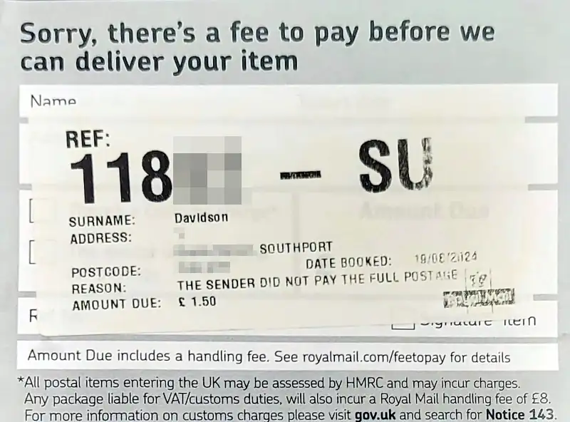

# [idea] - The stamp fell off

Got one of these this morning:

Apparently £1.50 which is the handling fee with no additional charge. So no idea
what happened there. But I'll be having words with the eBayer anyway.

But it got me thinking... Take a slip of roofing lead that's over 100g with an
offensive message written on it, pop it into a second hand bubble envelope and
attach a 2nd class stamp for 68p. That's over the 100g for a letter, so costs
£3.50 to send. Plus the £1.50 surcharge, the recipient has to pay £4.32 to
receive your insult.

A cost-amplification attack using the postie. Might just do it to someone to see
if it works 😂
