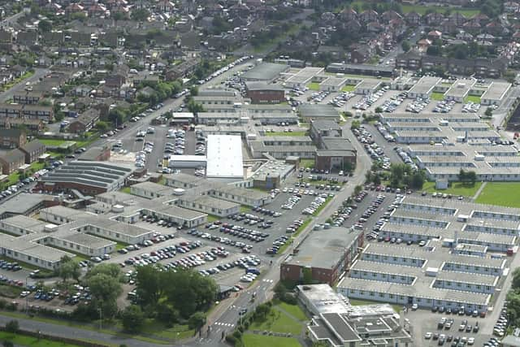
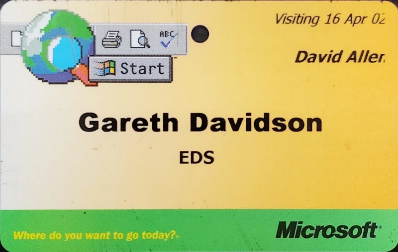

# Fylde Coast vs Thames Valley

While looking for my old Amiga floppy disks, I found my security pass from my
first visit to Microsoft. It brings back memories, so it's as good an excuse as
any to reflect on the trends and who I was 22 years ago, to bang on about the
North/South divide and shoehorn in some class consciousness.

## Lytham St Anne's

From 2001 to 2005 I was a performance tester for the Department for Work and
Pensions. Contracted to EDS, my job was to load test 3rd party applications
ported from MS Access and spreadsheets, to prove they worked as web apps running
in our on-site server room. EDS's job, as a US consultancy, was to extract
maximum British taxpayer money by renting their old staff back to them at four
times the price. I think we were both pretty good at our jobs.

These apps ran on-site, and on-site at the time meant in sandy St. Anne's on the
Sea, in the now demolished DWP offices on Heyhouses Lane. The place was just
outside Blackpool, North of RAF Warton in Lytham, and was apparently a wartime
hospital built in about ten minutes between air raids.

The site was stereotypically old Labour; functional, no frills, good enough for
the civil servants within, peasants who were only middle class by virtue of
being told to work with paper rather than a shovel. As musty and flat roofed as
a council estate pub, with double swinging doors and cast iron radiators used by
NHS hospitals and inner city schools, secondary glazing added during a
turd-polish renovation in the late 1980s, long uneven corridors a constant
reminder that the Gospel of Matthew and Luke was ignored.

Thinking of pubs, like all UK Government sites at the time it did actually have
a boozer on site. It also had grimy smoking rooms with yellow stained walls,
each with a loud extractor fan choking on a decade of tar.

You get the idea.

## A technical intermission

Back to the job, these sort of applications were built by either the golf club's
most optimistic bidder, or a small dev house with great business domain
knowledge and expertise in client-side software, but none in the high volume,
3-tier architectures that they were writing for. So as you can imagine, they
generally crumbled under the load and needed re-engineering.

We were testing a couple of them a month. As the software was both third party
and proprietary, this typically meant dumping network traffic using a recording
proxy or a span port on the network switch, going through the dumps, reverse
engineering the protocols and rewriting bits of JavaScript in C or C++,
generating end-to-end scenarios as code, then driving it using data we generated
and dumped into CSV files, pre-loading databases by generating SQL. We'd then
run the binaries in LoadRunner or Facilita Forecast, report on response times
and system stability, and usually get deep enough of an insight to tell the devs
exactly what they were doing wrong.

In April 2002, Microsoft shoving their answer to Java down everyone's collective
throats, their new, and disastrously named Microsoft .Net. Out went Active
Server Pages and their ugly Visual Basic `.asp` scripts, in came `.aspx` ones
running VB.Net *modules*, goodbye C++ client-side apps and hello to C#, which
is just VB dressed like Java to avoid being bullied. So when an ancient and
vital `bureaucracy.exe` wouldn't work on the DWP's shiny new Windows XP
desktops, the recommendation was to rewrite the thing in C# and throw it on a
web server. So that's what they did.

And, of course, .Net being so new, the wheels came off at modest load. Scaling
out was possible and would have cost several million, which the taxpayer would
have paid, but fortunately that wasn't an option because the software caused the
.Net runtime to pause intermittently for almost a minute during use. So it
wouldn't even pass UAT let alone perf test, specially when the functional tester
had heard how bad performance was in the smoking room. After a couple of failed
test rounds, two missed deadlines and a political storm on the horizon, the dev
house splashed out for a week at Microsoft's scalability labs in Reading to
search for a solution, and we were invited along.

To wrap up the technical part of this journey, it was indeed the garbage
collector choking on lots of small objects, but unlike Sun's Java, Microsoft's
Java\^H\^H\^H\^H .Net runtime choked the entire operating system.

## Thames Valley Park

So off we went to TVP, and here's the trophy I found today.

Thames Valley Park was worlds away from Heyhouses Lane. Glass doors, high
resolution flatscreen monitors connected digitally, computers with as much RAM
as you asked for and they even had graphics cards. Their carpets didn't have any
stains on them, and instead of some tattooed bloke in a security box smoking a
rolley they had this attractive receptionist that smelled of flowers and spoke
with a singy-songy voice. Rather than a canteen with pie, chips and gravy served
by dinner ladies, they had a restaurant with a chef frying fresh noodles in a
wok. Each office had a kitchen with free tea and coffee, and free cans of coke
in the fridge. The coffee wasn't even freeze dried, and there were beers in the
fridge too. They wouldn't have lasted ten minutes up North.

But nobody was drinking at lunch time. The park area with a fountain was empty,
the Xboxes, pool and foosball tables there mostly for show or for guests, and
the staff didn't fuck off to the pub at half five on the dot, they needed that
free coffee to work until 9PM. And I cracked a couple of funnies that fell flat
and caused side-eyes and gritted teeth, turns out politically correct gags are
the only sort allowed in the South East.

If our team of three atheists, two Muslims, a Jew and a Christian had all went
then our friendly banter would have prompted mandatory diversity training for
the entire TVP site. And our boss, she'd have been ejected for sexual harassment
before finding a desk. If we'd had had a rogue lunchtime BBQ outside TVP1 (I
should write about that, it was funny) I suspect that receptionist would have
called the fire brigade, rather than the security guard asking us what the fuck
we were doing but letting us get on with it.

At the time I was jealous of TVP, but looking back there wasn't that much to be
jealous of, we had it way better at the DWP. I'm tempted to say we lacked the
fur coat but at least we had knickers, but it's probably the other way round.
Microsofties wore jeans and t-shirts to work so they could lie about how casual
and cool they were and their great work/life balance, while we wore suits and
ties to lie about how civilized and professional we were.

If that's a conclusion it's admittedly not a great one, but it's a story anyway.
