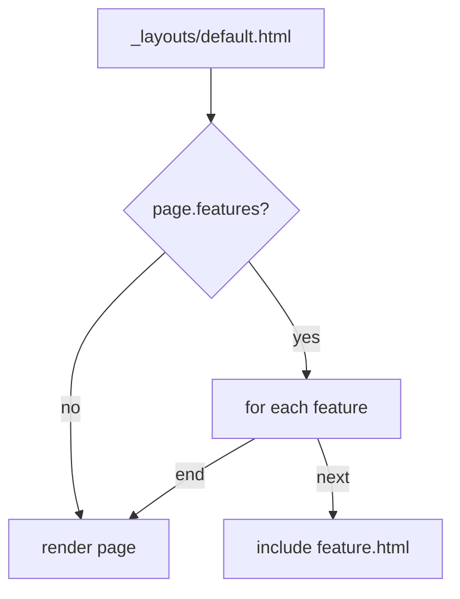

# 🎃 New features

So I can now render mermaid inline, using JavaScript if it's supported and just
show the code if it isn't.

## Big deal

Yeah, anyone can just add the mermaid.js to their pages, right? No. That adds
100k to every page. So I went with this:



## How?

The trick comes from [`_layouts/default.html`](https://github.com/bitplane/bitplane.github.io/blob/main/_layouts/default.html)
letting me add features:



```liquid

        

```



...the front-matter in [this file](https://github.com/bitplane/bitplane.github.io/blob/main/log/2024/10/a-matter-of-features/index.md)
having the "mermaid" feature:

```markdown
---
features: ["mermaid"]
---
```

...and the [mermaid feature](https://github.com/bitplane/bitplane.github.io/blob/main/_includes/mermaid.html)
including the JavaScript that replaces the code blocks for the div class Mermaid
expects, and initializing the thing:

```html
<script src="/assets/js/mermaid.min.js"></script>
<script>
  document.addEventListener("DOMContentLoaded", function() {
    const mermaidBlocks = document.querySelectorAll('.language-mermaid');
    mermaidBlocks.forEach(block => {
      const div = document.createElement('div');
      div.className = 'mermaid';
      div.innerHTML = block.textContent;
      block.replaceWith(div);
    });
    mermaid.initialize({ startOnLoad: true, theme: 'dark' });
  });
</script>
```

So, I can finally publish articles with graphs in them.

Expect the first one soonish.
