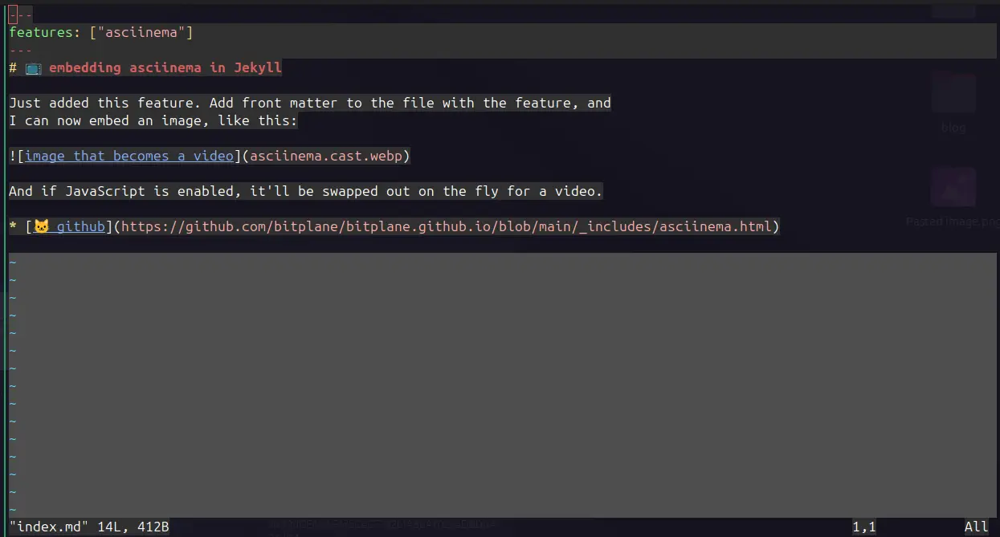

# 📺 embedding asciinema in Jekyll

Just added this feature. Add front matter to the file with the feature, and
I can now embed an image, like this:

And if JavaScript is enabled, it'll be swapped out on the fly for a video.

* [🐱 github](https://github.com/bitplane/bitplane.github.io/blob/main/_includes/asciinema.html)

