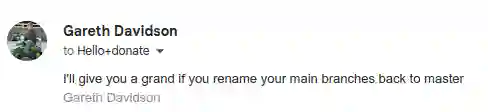
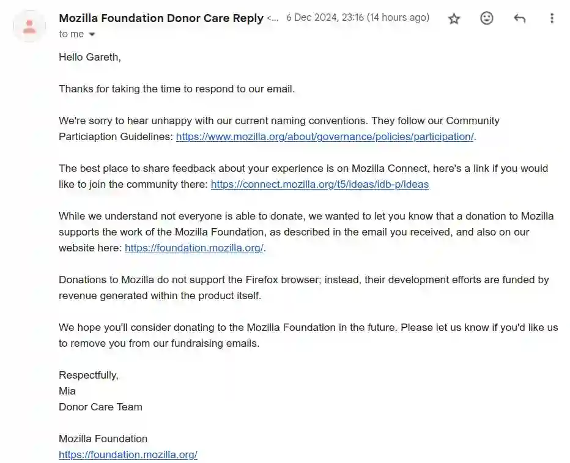
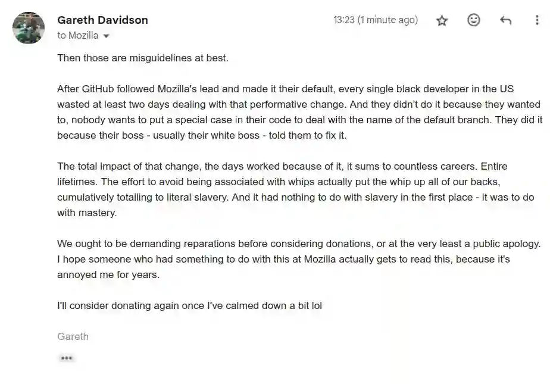

# 🖕 remainders btfo

I've renamed all my default branches back to `master`. I'd been suffering in
relative silence for years with extra test cases in code that deals with repos,
and finally decided to be less of a coward.

I'm British, so don't have a race-based class system that would make me need to
harbour racial guilt. I also think that taking offence without it being given
makes you the aggressor, and in this case I'm the aggressor. The pricks at
Mozilla and GitHub who pushed this change on everyone else care more about
looking good than doing good. So fuck them.

## The catalyst

