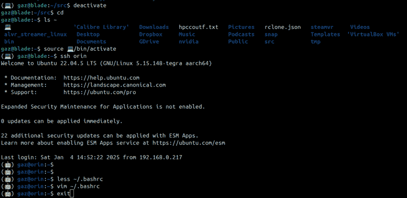

# 😄 Emojing

A couple of emoji-related updates.

* 1️⃣ I managed to replace my bullet points with the emoji after them,
  using a CSS hack for [`ul>li::first-letter`](/assets/css/style.css)
* 2️⃣ I decided to pmake my Python venv dir name an emoji, so a graphical
  description of the box shows up in my terminal. I'll try to refrain from
  doing this in my Makefiles, but no promises 'cause it looks really nice.

