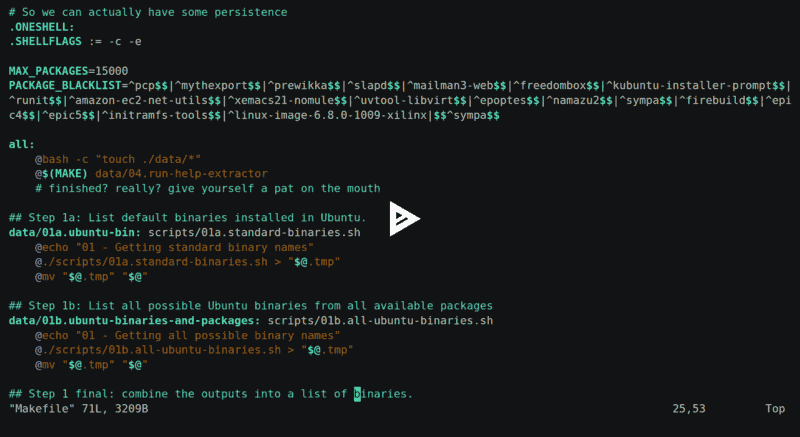
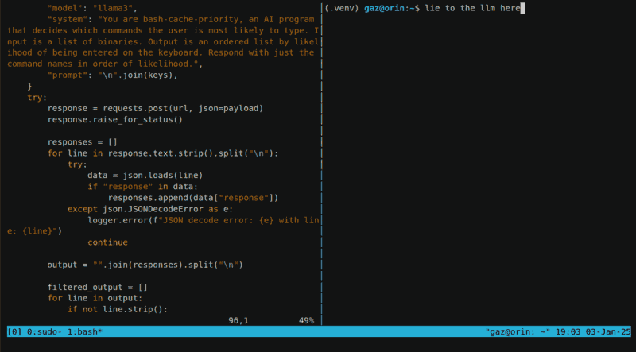
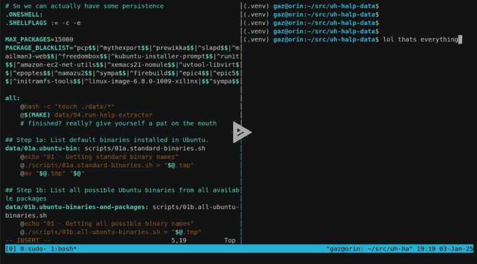
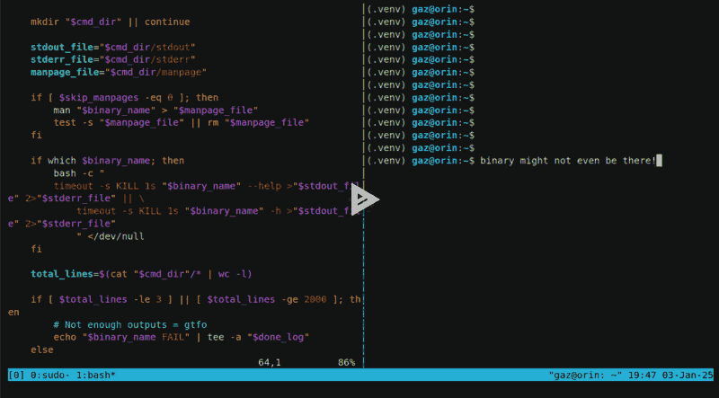
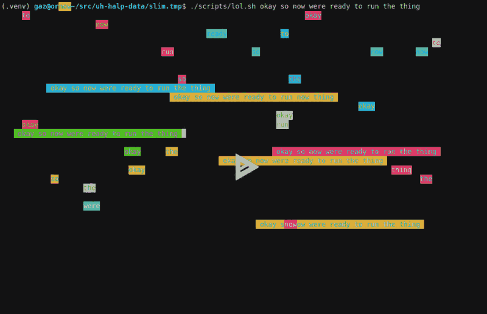

# 🤖 uh-halp-data

Over the Christmas break I've been working on a dataset to train a small model
that can be used to run [uh-halp](/dev/python/uh-halp) offline.

This has been a bit of a slog.

## 📺 uh what?

The app is a command line tool that tells you what to type on the command line,
for people who are old and forgetful like me. A picture is worth 0x1000 DWORDS,
and a video even more.

So here's an example:


Problem is, the thing needs to send your queries to an external service, which
means having an account and a key and a config and an Internet connection and
[so on and so on and so on...](/home/gaz/Documents/poetry/401). Which I'm not a
big fan of.

It kinda goes against the whole idea of it being free software, if your freedom
to use it is mediated by an LLM provider. But I got myself an Nvidia Orin and
can run language models now. At least if I've got a connection to the thing and
ollama is running.

But llama can create data, and I've got enough RAM for training now... so, why
not have a stab at making a model that can run offline, on machines with
minimal compute and space resources.

So yeah. Sounds like a "fun" project, right?

## 🖹 the data

Data needs to be tons of pieces of text like this:

```text
Q: how much space is left here
A: df -h .
Q: how many files are in here
A: find . -type f | wc -l
Q: ssh me@box but forward X so I can do gui stuff
A: ssh -X me@box
```

## 🦣 Data collection pipeline

And so, I decided to embark on a mammoth data collection exercise. One of many
maybe, or 0.5 of many if I never actually finish it. Time will tell.

### 📦 1. ALL THE THINGS

First up, we need all the binaries that exist. This is an impossible task, but
in Ubuntu we can install `apt-file`, run `apt-file update` and grep its lz4
archives for stuff in `/bin` and `/usr/bin`.

Yeah that doesn't give us everything, but if you add in `/etc/alternatives` and
all the default binaries too (`/sbin` and the shell builtins) then you've got a
pretty solid list for starters. The tool supports Windows too, but I'll eat
that particular can of worms when I open it.

So just Ubuntu. Using Docker. Easy-peasy.



### 📈 2. Popularity contest

Then we need to know which ones people are actually likely to type in to a
computer, and in turn are likely to need help on.

One way I could do this is by pulling all the .sh files I can get my hands on,
or running `strings` on the entire world, and tallying them up. Or I could type
in as many commands as I can remember - which is a list that's getting shorter
every day.

But I've got a shiny new AI box thing, and fifty quid still sat on
[vast.ai](https://vast.ai/) burning a hole in my account. So why not get llama3
to do it for me?

So that's what I do, tell the language model that its job is to sort software
by likelihood of being typed by a user:

```text
You are bash-cache-priority, an AI program that decides which commands the user
is most likely to type. Input is a list of binaries. Output is an ordered list by
likelihood of being entered on the keyboard. Respond with just the command names
in order of likelihood.
```

And pass it a list of 10 random commands. And then the next 10 and so on. Once
it's ranked each group, I give them a score based on their rank order.



#### 🤦 shouldawouldacoulda

* The scoring is skewed, it should give `1.0/len(list)` to each item each pass
  and make some effort to figure out the average score. I'm sure some useful
  commands must have ended up with low ranks because of this.
* I didn't tell llama to exclude GUI apps.
* I tried a process using pipes and shell scripts at first, but it's much more
  efficient to use a proper POST with a system prompt. You can probably set up
  the prompt by hacking ollama's manifest files, but nobody got time for that.

### 📦 3. ALL THE THINGS (part 2)

Now we just need to install each of the packages, right? Should be simple
enough, as long as we're sensible enough to only install the few hundred that
matter.

Turns out the datahoarder in me wouldn't allow that, so I ran it to completion
for `aarch64` and `x86_64`. Which cost a bit of disk space...

```text
REPOSITORY                        TAG                    CREATED        SIZE
uh-halp-data-binaries             ubuntu-13000-aarch64   2 hours ago    201GB
uh-halp-data-binaries             ubuntu-12500-aarch64   5 hours ago    194GB
uh-halp-data-binaries             ubuntu-12000-aarch64   7 hours ago    188GB
...
uh-halp-data-binaries             ubuntu-1000-aarch64    30 hours ago   27.7GB
uh-halp-data-binaries             ubuntu-500-aarch64     31 hours ago   17.7GB
uh-halp-data-binaries             ubuntu-base-aarch64    32 hours ago   1.46GB
```

I pushed these up to Docker Hub, but I imagine they'll get culled for using a
piss taking amount of disk space. Here they are though:

* [🐋 docker hub]()



#### 🤦 oofs

* With such a mix of packages, some of them are bound to fail to install, and
  complain every time it makes a change.
* So I needed a package blacklist, which blows my Docker cache.
* So they have to be split into batches. I picked 500 for the batch size. Then I
  split this into groups of 20 and install those. Then save to a Docker image.
  If I make changes to the blacklist and re-run, it at least only builds a few
  layers.
* No space left on device.

### 🛟 4. Help extraction

Next step is extracting the `--help` for each program. Simple, just call it for
each program and save the output, right?

Yeah, right.

With 40,000 programs to run, you run into a lot of badly behaving ones, ones
that existed 40 years ago, ones that expect people in their problem domain to
expect certain things. There's a lot of variation:

* Older BSD type commands keep their help in the manual and see `--help` as
  flags `-` `e` `l` `p`, and fail.
* Some programmers have apparently never even heard of the command line or
  expect anyone to ask for help outside their long dead website, or open an
  interactive terminal and block forever.
* Some will eat your stdin, so you can't just use `read` - you need to pipe
  `/dev/null` into them.
* Others don't honour the SIGnal for INTerrupt, you need to KILL them when you
  lose patience.
* Some output ANSI escape sequences to stdout, so if you're teeing logs to your
  terminal too it'll end up reconfigured to not work with `\n` and turn echoing
  off or whatever.
* Some piss out a billion lines of noise to stdout, which fills your disk.
* Some create files in the working directory, because they're more important
  than anything else you might happen to be doing.
* Some send their `--help` text to stderr because that's what the framework
  they're using does by default, and so they do too.

So I create a separate dir for each program. I run it on a 1 second timeout and
kill the thing if it takes too long. Then run it with `-h` if it failed. And
extract the manpages too.

If the outputs are too large, I remove the dir instead of copying it out of the
container.

The final outputs are here:

* [😺 github](https://github.com/bitplane/uh-halp-data/releases/tag/0.0.4)



#### 🤦 gahwtfkinshii

* All that stuff above.
* Murphy's law applies at scale.
* Diversity is frustration, freedom is toil, disk is in pieces.
* The folks at Canonical helpfully minimize their cloud images, so `man` is
  replaced with a shell script that prints out a message telling you to run
  unminimize. And its exit code is... wait for it... `0`.
  So I had to build everything again. And again, and again, for other
  reasons. But that one time it was their fault. And mine. But also theirs.

Links:

* [🐛 bug](https://bugs.launchpad.net/ubuntu/+source/man-db/+bug/2092673)
  for the above Ubuntu man-db / cloud-images issue.
* [🐱 github](https://github.com/bitplane/uh-halp-data/releases/tag/0.0.3)
  release of `/usr/share/doc` from the final image.

### 📦 ALL THE THINGS (part 3)

Because the Docker images are too large to actually manage, I dumped the
contents out, reset all the atimes, mounted the root dirs, and re-ran the
help extractor again. Then removed all the files that weren't accessed.
Then ran UPX over all the binaries and rebuilt the image.

This brings the 208GB image down to a more respectable 13GB. 🎉

Why not use `docker-slim` like a reasonable human being? Well, it failed on
the base image and I didn't want to wait for it to run for the larger ones.
Raised a [🐛 bug report](https://github.com/slimtoolkit/slim/issues/741)
though, so there's that!

### 💩 5. Usage scenarios

Early on during testing, it became pretty clear that llama, when asked for
usage scenarios and given the manpages, it'd just regurgitate what is in the
manual.

So I needed some kind of 


