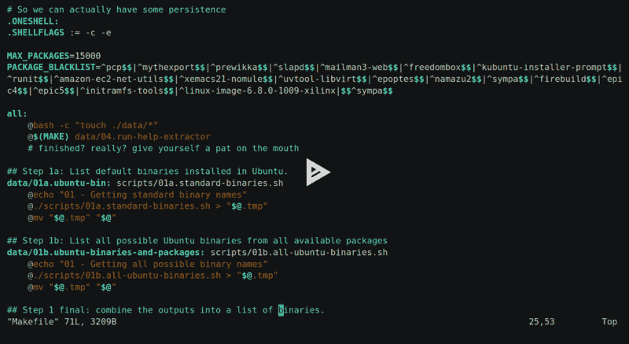

# 🤖 uh-halp-data

Over the Christmas break I've been working on a dataset to train a small model
that can be used to run [uh-halp](/dev/python/uh-halp) offline.

This has been a bit of a slog.

## 📺 uh what?

The app is a command line tool that tells you what to type on the command line,
for people who are old and forgetful like me. A picture is worth 0x1000 DWORDS,
and a video even more.

With that in mind, here's an example:


Problem is, the thing needs to send your queries to an external service, which
means having an account and a key and a config and an Internet connection and
[so on and so on and so on...](/home/gaz/Documents/poetry/401). Which I'm not a
big fan of.

If your freedom to use a program is mediated by an LLM provider then it can't
really be called free software. But I recently got myself an Nvidia Orin and can
run language models now. At least if I've got a connection to the thing and
ollama is running, which users might not have.

But llama can create data, and I've got enough RAM for training... so, why not
have a stab at making a model that can run offline, on machines with minimal
compute and space resources.

So yeah. Sounds like a fun project, right? A view that aged like warm milk.

## 🖹 the data

Data needs to be tons of pieces of text like this:

```text
Q: how much space is left here
A: df -h .
Q: how many files are in here
A: find . -type f | wc -l
Q: ssh me@box but forward X so I can do gui stuff
A: ssh -X me@box
```

---

## 🦣 0. A data collection pipeline for mammoths

And so, I decided to embark on this gigantasoric data collection exercise. One
of many maybe, or 0.5 of many if I never actually finish it.

I drive the process with a `Makefile`, which has target data files as outputs
and scripts as inputs. This, as usual, is a mixed blessing. Having suffered
this process a couple of times now, I might not do it this way again.

Or maybe I will because I prefer to gloat about other people's mistakes than
learn from my own.

The approach looks like this:

* I put my data in the `data` dir, and some scripts in the `scripts` dir.
* Each step depends on some piece of data and a script or two.
* I hack the `all` target in the `Makefile` and run `make` whenever.



### 🤦 mental challengings

* The names of the scripts, the data files and the Make steps quickly go out
  of sync. They say naming things is the hardest problem in computing, well
  renaming things is worse, fragile and a pig's arsehole of a task but without
  the pleasure.
* Naming my scripts `01.*` and so on worked well at first, then I needed more
  pipeline steps and `01a` etc were born. And I had to remember them. Not fun.
* I had to turn bell off in my terminal because tab completion is, well, if
  you've been there you'll know it makes your middle finger ache. Or maybe
  that's just me 🔔🖕
* I deleted all my data on more than one occasion by putting a space in after
  the data dir while running rm with `-r`. Setting the files to read-only
  didn't help because `-f` is muscle memory by this point. Running on a Mac
  might have, since it's less "friendly" with its flag and target ordering.

## 📦 1. ALL THE BINARIES

First up, we need to know all the binaries that exist. Thisimpossible task is
somewhat possible in Ubuntu as we can install `apt-file`, run `apt-file update`
then grep its lz4 archives for stuff in `/bin` and `/usr/bin`.

That doesn't give us everything, but if you add in `/etc/alternatives` and all
the default binaries too (`/sbin` and the shell builtins) then you've got a
pretty solid collection.

`uh-halp` supports Windows too, but I'll eat that can of worms when I open it.
It's not like you can just do `pip install uh-halp` and the thing appears on
your path in Windows, because `python` is buried in an ever-moving dir.
Bronchitis limits the amount of time somebody has got for Windows anyway.

So just Ubuntu packages for now. Using Docker. Easy-peasy:


### 📈 2. Popularity contest

Then we need to know which ones people are actually likely to type in to a
computer, and in turn are likely to need help running.

One way I could do this is by pulling all the .sh files I can get my hands on,
or running `strings` on the entire world, and tallying them up. Or I could
carefully parse the package list and look at deps of deps, and see which ones
are used that way. Or I could type in as many commands as I can remember -
which is a list that's getting shorter every day.

But I've got a shiny new AI box thing, and fifty quid still sat on
[vast.ai](https://vast.ai/) burning a hole in my account. So why not get llama3
to do it for me?

So that's what I do, tell the language model a white lie and have it sort
the names of programs by likelihood of being typed into a terminal:

```text
You are bash-cache-priority, an AI program that decides which commands the user
is most likely to type. Input is a list of binaries. Output is an ordered list
by likelihood of being entered on the keyboard. Respond with just the command
names in order of likelihood.
```

And pass it a list of 10 random commands. And then the next 10 and so on.

Once it's ranked each group, I give them a score based on their rank order.
Then sort, take the mean and repeat for the ones that are most useful. Pretty
cool trick!

* [🐱 github](https://github.com/bitplane/uh-halp-data/releases/tag/0.0.1) -
  Popularity contest results.


### 🤦 shouldawouldacoulda

* The scoring is skewed, it should give `1.0/len(list)` to each item each pass
  and make some effort to figure out the average score. I'm sure some useful
  commands must have ended up with low ranks because of this.
* I didn't tell llama to exclude GUI apps. So the first time I ran it, I ended
  up opening a million apps over `ssh -X` which I'm using for my clipboard
  aliases.
* I tried a process using pipes and shell scripts at first, but it's much more
  efficient to use a proper POST with a system prompt. You can probably set up
  the prompt by hacking ollama's manifest files, but that's more complexity
  and complexity at scale can be measured in square inches of in lost hair.

## 🐋 3. ALL THE THINGS (part 2)

Now we just need to install each of the packages, right? Should be simple
enough, as long as we're sensible and only install the few hundred that
matter...

Turns out the datahoarder in me wouldn't allow that, so I ran it to completion
for `aarch64` and `x86_64`. Which cost a *bit* of disk space...

```text
REPOSITORY                        TAG                    CREATED        SIZE
uh-halp-data-binaries             ubuntu-13000-aarch64   2 hours ago    201GB
uh-halp-data-binaries             ubuntu-12500-aarch64   5 hours ago    194GB
uh-halp-data-binaries             ubuntu-12000-aarch64   7 hours ago    188GB
...
uh-halp-data-binaries             ubuntu-1000-aarch64    30 hours ago   27.7GB
uh-halp-data-binaries             ubuntu-500-aarch64     31 hours ago   17.7GB
uh-halp-data-binaries             ubuntu-base-aarch64    32 hours ago   1.46GB
```

I pushed these up to Docker Hub, but I imagine they'll get culled for using a
piss taking amount of space.

Here they are though:

* [🐋 docker hub](https://hub.docker.com/repository/docker/bitplane1/uh-halp-data-binaries)


### 🤦 oofs

* With such a mix of packages, some of them are bound to fail to install, and
  complain every time it makes a change.
* So I needed a package blacklist, which blows my Docker cache.
* So they have to be split into batches. I picked 500 for the batch size. Then I
  split this into groups of 20 and install those. Then save to a Docker image.
  If I make changes to the blacklist and re-run, it at least only builds a few
  layers.
* No space left on device.
* No space left on device.

## 🛟 4. Help extraction

Next step is extracting the `--help` for each program. Simple, just call it for
each program and save the output, right?

Yeah, right.

With 40,000 programs to run, you run into a lot of badly behaving ones, ones
that existed 60 years ago, ones that expect people in their problem domain to
expect certain things. There's a lot of variation.

* Older BSD type commands keep their help in the manual and see `--help` as
  flags `-` `e` `l` `p`, and fail.
* Some programmers have apparently never even heard of the command line or
  expect anyone to ask for help outside their long dead website
* Some like to open an interactive terminal and block forever.
* Some will eat your stdin, so you can't just use `read` - you need to pipe
  `/dev/null` into them.
* Others don't honour the SIGnal for INTerrupt, you need to KILL them when you
  lose patience waiting for them to realise they're talking to a pipe not a
  user, which they never will.
* Some output ANSI escape sequences to stdout, so if you're teeing logs to your
  terminal it'll end up reconfigured to not work with `\n` and turn echoing
  off or whatever.
* Some piss out a billion lines of noise to stdout, which fills your disk.
* Some create files in the working directory, because they're more important
  than anything else you might happen to be doing.
* Some send their `--help` text to stderr because that's what the framework
  they're using does by default, and so they do too.
* Some have undocumented dependencies.

So I create a separate dir for each program. I run it on a 1 second timeout and
kill the thing if it takes too long. Then run it with `-h` if it failed. And
extract the manpages too.

If the outputs are too large, I remove the dir instead of copying it out of the
container. Then it was simply a matter of figuring out which of the 3 files
contains the most useful information, not not too much, as it needs to be
passed to an LLM for processing and leave some context space for answers.

The outputs of the help generation steps are here:

* [😺 github](https://github.com/bitplane/uh-halp-data/releases/tag/0.0.4)


### 🤦 gahwtfkinshii

* All that stuff above; Murphy's law applies at scale.
* Diversity is frustration, freedom is toil, disk is in pieces.
* The folks at Canonical helpfully minimize their cloud images, so `man` is
  replaced with a shell script that prints out a message telling you to run
  unminimize. And its exit code is... wait for it... `0`.
  So I had to build everything again. And again, and again, for other
  reasons. But that one time it was their fault. And mine. But also theirs.
* I filtered by line count on the outputs, and some commands just output
  a load of noise without any line breaks.

#### Links

* [🐛 bug](https://bugs.launchpad.net/ubuntu/+source/man-db/+bug/2092673)
  for the above Ubuntu man-db / cloud-images issue.
* [🐱 github](https://github.com/bitplane/uh-halp-data/releases/tag/0.0.3)
  release of `/usr/share/doc` from the final image when manpages were
  missing. Might be useful to someone.

## 🐋 5. Compressing the Docker images

Because the Docker images are too large to actually manage, I dumped the
contents out, reset all the atimes, mounted the root dirs, and re-ran the
help extractor again. Then removed all the files that weren't accessed.
Then ran UPX over all the binaries and rebuilt the image.

This brings the 208GB image down to a more respectable 13GB compressed, 24GB
when installed. 🎉

Why not use `docker-slim` like a reasonable human being? Well, it failed on
the base image and I didn't want to wait for it to run for the larger ones.


### 🤦 snafu very much

* Being too impatient for `docker export` to do its business, I decided to dump
  the image contents with `tar` over a pipe. But ran out of space on the Orin
  box. Twice. And had to download it all from Docker Hub again.

#### Links

* [🐛 bug report](https://github.com/slimtoolkit/slim/issues/741) for slim
  toolkit.

## 📃 6. Usage scenarios

Early on during testing, it became pretty clear that llama, when asked for
usage scenarios and given the manpages, it'd just regurgitate what is in the
manual rather than come up with scenarios that a user would do.

So I needed to steer it in a way where it first generates user scenarios based
on the program's help, then make it generate questions that a user might ask
to use the program.

As an extra bonus, I want it to at least be aware of adjacent commands too. So
here's the prompt that survived a few rounds of testing:

```text
There is a program called "$command_name". It performs the following function:

$help_text

We want to understand how this program is used in real-world scenarios. Generate:
1. A one-line summary of the program's purpose.
2. List other commands that are frequently used with it, or are related.
3. A list of 10 realistic use cases where humans commonly use this program. Each use case should:
   - Be unique and practical
   - Focus on real-world tasks, ones that can be solved by typing the command name in.
   - Describe a reason why you'd type the program into the console.
   - Focus mainly on common scenarios, rather than exotic or speculative ones.

Here’s an example for the `ls` command:

**COMMAND NAME:** ls  
**SUMMARY:** Lists the contents of directories.  
**RELATED:**
* find, xargs, file, stat, du, sort
**USE:**
1. I want to see what files are in this directory.
2. Which file in here is the biggest?
3. Do any of these files have broken permissions?
4. Are there .txt files in this dir? 
5. Which one of these files just got written to?
6. How many files are in here?
7. What hidden files are in here?
8. Combine with `grep` to find specific filenames in a directory.
9. Pass these files to `xargs` and pass to another program.
10. Save this list of files for later.

Now, generate outputs for the following command:

**COMMAND NAME:** $command_name
```

And let it generate the scenarios


## 👨‍🦰 7. uh gen

And finally, now we have some data that we can use to generate user scenarios.
The primary user being me, of course.

There's a few different scenarios I generally use:

* I've no idea what I'm doing, I just want to get something done. Usually I ask
  ChatGPT when `uh` fails me. But it often works.
* I know what command I want to use, but I don't know what the flags are. `uh`
  is really handy for this sort of thing. If it fails, I'll grep `--help` or the
  manpage. I want to reduce the amount of times I do this.
* I just want a second opinion on something.
* I want to know where something system related is.

A full manpage extract would provide data for the last step, but that can come
later. Knowing the flags to every program in existence, and how to install it on
Ubuntu would help a lot with the rest.

...

## 🚂 8. Training


