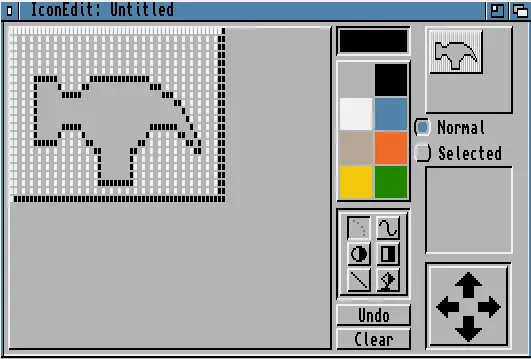
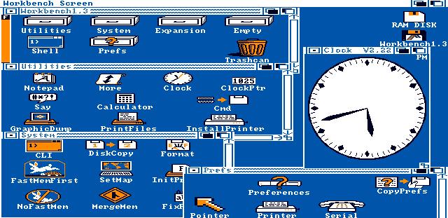
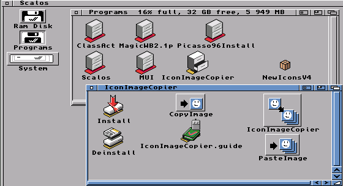
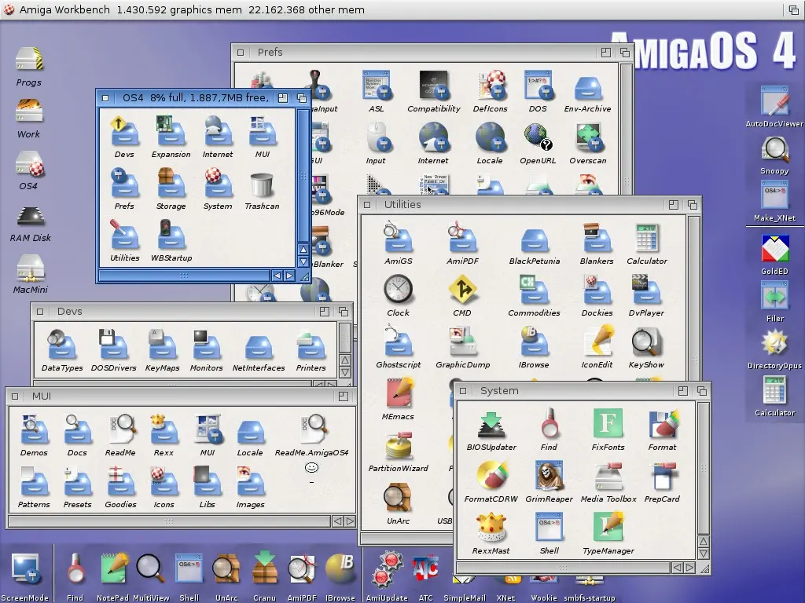
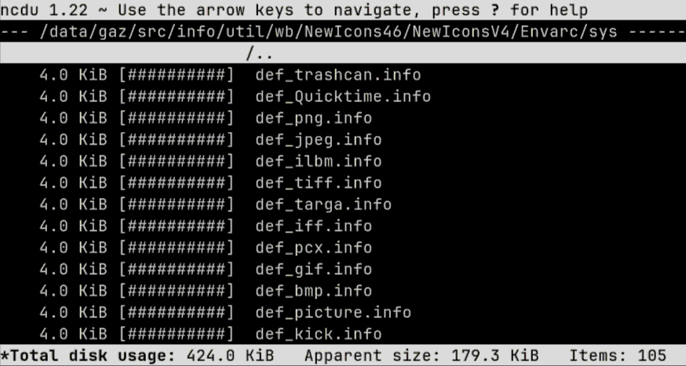
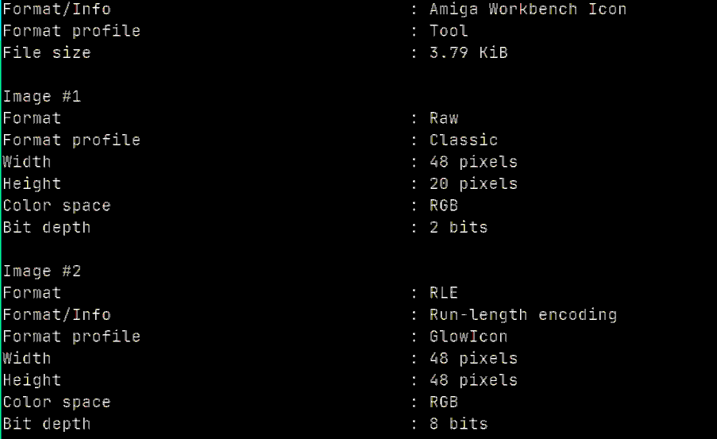
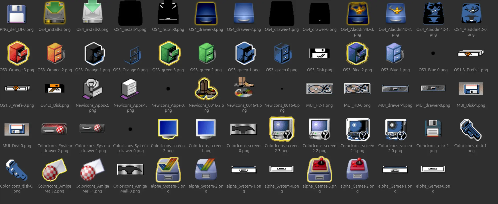

# ℹ️ Amiga Workbench .info files

Between a bit of contract work and a new job, I went back to my Amiga disk and
pulled out some more goodies. Among them were a ton of `.info` files, holding
pixels and location metadata for icons in AmigaOS's Workbench desktop. I have
fond memories of using IconEdit in the '90s making these for my games. Anyone
who owned an Amiga during the multimedia revolution will remember this thing:

But there wasn't an easy way to open, convert or work with them out of the box
in modern Linux, which led to the sort of rabbit hole that eats your last week
of freedom, and then some.

## 📂 The file format

`.info` files are actually 4 stacked things and one adjacent one.

In the beginning there was the Classic 1980s `.info` format, and it was good.
This is two icon pictures, one for deselected and one for the selected, with
pixel data stored in planar format. These bitplanes were combined as God
intended, by stacking them and mapping to a palette entry in the current theme.
They also contained the icon's coordinates in its parent "drawer" (dir), and the
dimensions of the drawer itself if it was one, plus other internal Workbench
gubbins. Icon files were seek-friendly, mutated as you moved them about, and
also contained ToolTypes, which are like environment variables or args passed to
the target program.

At the start of the 90s more colourful desktops arrived, and with them came a
hack called NewIcons. This plugin unofficially extended the icon format by
embedding image data into the ToolType texts, remaining backwards compatible.
These icons held RGB information but were downsampled to the current palette on
use. And it was good, if a bit slow.

With OS3.5, we got support for IFF - but not ILBM - icons: faster, prettier and
more consistent. Later still, after the fall of Commodore and IFF's
fashion-death, OS4 introduced an unorthodox zlib compressed 32-bit ARGB icon
format.

Somewhere along the way, a new hack called PowerIcons became official among
OS4, MorphOS and AROS. These are two concatenated PNG files with .info metadata
embedded inside an `icOn` chunk in the first image. It was heresy.

That's mostly the story, and about the right amount of cruft for 20 years of
uneven advances in raster graphics.

## 📧 .info as a MIME type

Despite the format being [well documented](http://www.evillabs.net/index.php/Amiga_Icon_Formats)
and parsing code being available
[in](https://github.com/aros-development-team/AROS/blob/master/workbench/libs/icon/diskobjio.c)
[places](https://github.com/steffest/Amiga-Icon-Editor)
[around](https://github.com/harbaum/infotool)
[the](https://github.com/jwilk-mirrors/netpbm)
[web](https://github.com/nicodex/HelloAmi/blob/master/Libs/icon.library.asm),
`file` didn't report the correct MIME type, and the format wasn't listed in
[PRONOM](https://www.nationalarchives.gov.uk/aboutapps/pronom/).

So I set about fixing that, now both libmagic and the National Archives know
about `image/x-amiga-icon` which is the MIME type used by NetSurf and older
tools, as listed in [WikiData](https://www.wikidata.org/wiki/Q28205479).

* [🪄 libmagic rule submission](https://bugs.astron.com/view.php?id=726)
* [🇬🇧The National Archives](https://www.nationalarchives.gov.uk/contact-us/submit-information-for-pronom/)

## 📦 All the .info files?

In order to prove my tool actually loads the things, I'd need some test data.
So I started off with
[steffest's test icons](https://github.com/steffest/Amiga-Icon-converter/tree/master/test-icons),
but these weren't ALL THE THINGS. So I downloaded [AmiNet](https://aminet.net/)
and extracted every archive I could find, snagging 300,000 .info files and
plopped them into a git repo, which I triumphantly shared about a bit for the
common good. Yes my mum is proud of me.

This isn't anywhere near ALL THE THINGS though, there were extraction errors
caused by the LHA extractor and non-ASCII file names (feels like dangerous RAM
corruption TBH, I'll investigate soonish). There's thousands of proprietary
games with icons available in the legally grey TOSEC collections, and I didn't
even extract the few ADF files on aminet. Maybe I'll add more later, maybe I
won't. 300k is probably more than enough, if you believe in "probably" and
"enough" as concepts.

* [🐱 github repo](https://github.com/bitplane/amiga-info-test-files)
* [🏛️ archive.org backup](https://archive.org/details/Amiga_Info_Files)

## 🐍 Writing a CLI

My main gripe was that I couldn't just install a command line tool from a
package manager and view them in `chafa`, or load them in Python and do fun
things with them. So, starting from the file format research and a huge number
of icons, I cooked up this library and command line tool. So now anyone can
convert Workbench icons or dump their meta out with `pipx run amigainfo --help`,
and can also load, edit and save them by importing `amigainfo`.

* [🏠 project page](https://bitplane.net/dev/python/amigainfo)
* [🐍 pypi package](https://pypi.org/project/amigainfo)
* [🐱 source code](https://github.com/bitplane/amigainfo)

## 🛏️ ...and a Pillow plugin

Along the way I figured out that Pillow supports plugins. Ideally I'd have
offered this up to Pillow, but I figured it's a busy project and the maintenance
and code review burden for such a niche format is probably not worth their time.

So I made it a Pillow plugin, which registers a Workbench .info loader when you
import the library. This will be linked on their site after the next release.

There's a potential side-quest here drumming up support for a pypi trove
classifier for `Framework :: Pillow`.

* [🛏️ pillow docs PR](https://github.com/python-pillow/Pillow/pull/9459)
* [🔗 classifer issue](https://github.com/python-pillow/Pillow/issues/8892)

## ℹ️ `mediainfo` contribs

I'd had a bit of fun in the past adding
[webp support](https://github.com/MediaArea/MediaInfoLib/pull/2262) to
MediaInfoLib, and my tatty code led to them splitting out the EXIF parser
so it now works with more formats. This should be a bit more self-contained, and
it'd be useful to search for specific icons in bash faster than Python can parse
them. And have them supported where `mediainfo` is available, which is actually
more places than you'd imagine.

So I ripped out the detection code and did a few passes at a reader written in
C. Tested on the 300k images, it parses the vast majority, reporting inline
errors when things are corrupted, tries to be defensive against DoS attacks and
memory corruption. If they like the code, maybe everything will know what's in
a `.info` file from now on:

* [ℹ️ MediaInfoLib PR](https://github.com/MediaArea/MediaInfoLib/pull/2547)

## 🧙 ImageMagick support

A more ambitious challenge would be to rewrite the lot, or at least the non-PNG
and Workbench metadata parts so anyone, anywhere can convert them to any format
using `magick convert`. I'd only ever added a trivial change to ImageMagick in
the past, it's a large and complex project so I always found bugfixes quite
daunting. But a whole new loader is pretty self-contained, and with a bit more
to squeeze out of the tube, I had a stab at that, too.

The results were pretty good, and having learned from the other two approaches
I stood a chance of fully processing the 300k images in C too. So, if all goes
well, ImageMagick might also get `.info` support outside of my fork.

* [🧙 ImageMagick PR](https://github.com/ImageMagick/ImageMagick/pull/8606)

## 🧒 In summary...

Diving back into something you loved as a child is always going to be fun, and
it's a bit sad getting to the end of a deep dive like this, with only bugfixes
and tweaking left. But there's plenty more formats in the library, ABK files
next maybe?
