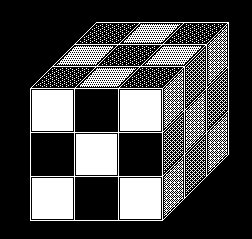
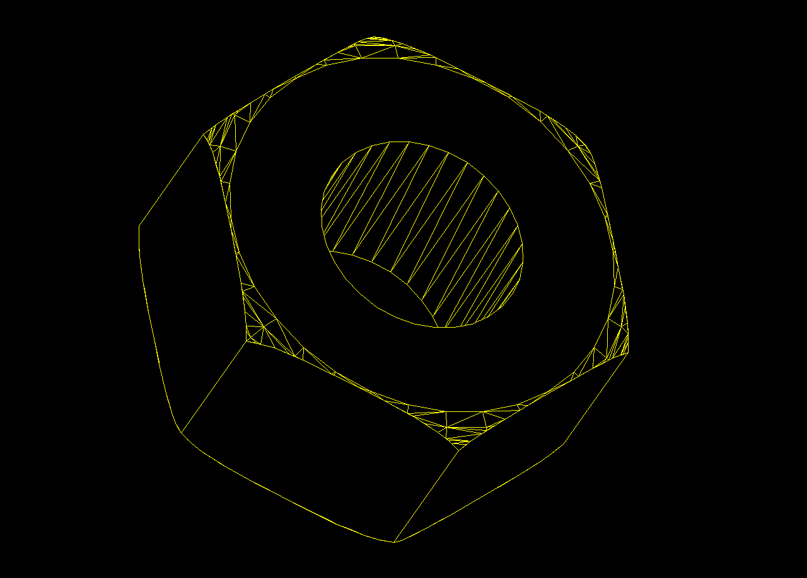
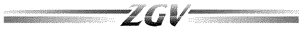
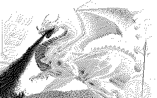
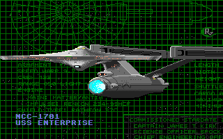
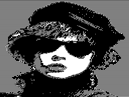
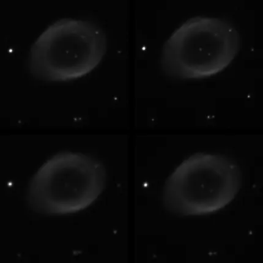

# 🖼️ Adventures in netpbm

Continuing on a journey of computing archaeology, it's time to extend Pillow
with a plugin that can load images that are supported by
[netpbm](https://en.wikipedia.org/wiki/Netpbm).

The first step was a bridge for the `anyto*` applications, but it turned out it
wasn't so reliable - the tools rely on `file` and many ancient and obscure
formats lack proper libmagic detection, some types of test data is hard to come
by. So I ended up having to write my own detection rules, which was a bit of a
pig.

I grabbed a bit of test data for formats I really care about (like
[seascape.iff](/log/2005/seascape)), created synthetic test data for as many as
I could using netpbm itself, pushed an alpha release to pypi and asked for it to
be added to Pillow's docs, so everyone in Pythonland can open the majority of
files with as little friction as possible.

This was the easy part.

* [🏠 project page](/dev/python/pillow-netpbm)
  * [📖 pydoc reference](/dev/python/pillow-netpbm/pydoc)
* [🐍 pypi package](https://pypi.org/project/pillow-netpbm)
* [🐱 github source](https://github.com/bitplane/pillow-netpbm)
* [🛏️ Pillow pull request](https://github.com/python-pillow/Pillow/pull/9482)

Then it was time to find test data around the web, figure out detection rules
for data that `file` didn't support, add functions where that's infeasible, link
in MIME types wherever they're wrong around the web, expand my test coverage and
open bug reports and pull requests to help steer various projects towards
consistency, update wikidata where I could be bothered, submit new types and
amendments to PRONOM, find bugs in my bridge and CI pipeline. And of course
document the research and work here as I go, partly because I have a short
memory, partly a lack of interesting things to write about, and a short memory,
but also to link sources for future archivists, and a short memory, and also for
the trophy cabinet 🏆.

---

## Andrew Toolkit Raster

A nice simple file format to load, a properly registered MIME type - at least
for the data format itself (`application/andrew-inset`) - with test data
available in the [project's source](https://www.cs.cmu.edu/~AUIS/) since the
90's.

`netpbm` can load and save these, but `file` thinks all Andrew files are
LaTeX documents, and the example raster files are buried in the distro's source
tree.

Let's fix both of those things:

* [🖼️ test data repo](https://github.com/bitplane/atk-raster-test-data)
* [🐛 libmagic bug report](https://bugs.astron.com/view.php?id=740)

---

## AutoCAD Slide

AutoCAD slides are vector screen dumps of AutoCAD created by MSLIDE and viewed
with VSLIDE. While the specs have been removed from
[AutoDesk's website](https://web.archive.org/web/20191223211310/http://www.autodesk.com/techpubs/autocad/acadr14/dxf/slide_file_format_al_u05_b.htm),
[Martin Reddy](http://www.martinreddy.net/gfx/2d/SLD.txt) has a backup.

This is when I discovered Robert Schultz's awesome
[test data collection](https://sembiance.com/fileFormatSamples/image/autoCADSlide/),
which I'm now mining for test data. These were detected as `data` by `file` -
which means no detection rule. Its
[PRONOM entry](https://www.nationalarchives.gov.uk/PRONOM/x-fmt/105) lists
3 different MIME types (`application/sld`, `application/x-sld` and
`image/x-sld`), and AutoDesk never actually registered an
`image/vnd.sld` with IANA. Unsurprising since other people registered their
other formats on their behalf, but they were registered and I always wanted to
do that. PRONOM's first entry has a weak collision with
`application/vnd.ogc.sld+xml`, and the bad MIME bleeds through into
[Archive Team's wiki](http://justsolve.archiveteam.org/wiki/Ext:sld), and across
github like in [MegaMimes](https://github.com/kobbyowen/MegaMimes) and
[Vitam](https://github.com/ProgrammeVitam/vitam-ui), presumably via
[DNSCore](https://github.com/da-nrw/DNSCore)'s seed data repo.

Fixing as much of this as possible, I contacted PRONOM, sent a PR to MegaMimes,
submitted a libmagic rules file, updated WikiData sources with links to existing
usage, started the IANA registration process for `image/vnd.sld` to replace the
`image/x-sld` I've been lobbying for. 40 years late, but better late than never
right?

Once the IANA registration is complete and/or detection rules are in libmagic, 
[Apache Tika](https://issues.apache.org/jira/projects/TIKA) and
[freedesktop shared-mime-info](https://gitlab.freedesktop.org/xdg/shared-mime-info/-/issues)
will one day follow suit. If not, I'll give them a nudge.

* [🪄 libmagic rules](https://bugs.astron.com/view.php?id=742)
* 🌍 IANA [submission](https://tools.iana.org/public-view/viewticket/1448324)
  [📨](https://mailarchive.ietf.org/arch/msg/media-types/5MUlMUJHMANhwVwAKLqAI0Z0NlA/)
* [🐛 MegaMimes PR](https://github.com/kobbyowen/MegaMimes/pull/4)
* [🌍 WikiData src links](https://www.wikidata.org/wiki/Q28049637)
* 🐛 PRONOM: TNA1774192312Q50

---

## FIASCO (Fractal Image And Sequence Codec)

This novel fractal video format was created back in '94-'99 by Ullrich Hafner
as part of his
[PhD thesis](https://www.semanticscholar.org/paper/FIASCO%E2%80%94An-Open-Source-Fractal-Image-and-Sequence-Hafner/68d43f493618ab61503f20696bc442cd00799dee).
It uses Weighted Finite Automata to compress the data, and the results are
superb - it crushes other formats of the time at low bitrates, the above heavily
compressed image would be unrecognisable as a 3.7K JPEG.

There's actually two file types here that share a similar magic: one is the
compressed binary data containing an image or some video, the other is an ASCII
basis dictionary used during compression. Writing an image loader means I only
care about the first type, but detection rules deserve to support both. netpbm
uses the `.wfa` extension for compressed files, while the standalone
[FIASCO tools](https://github.com/l-tamas/Fiasco) use `.fco` for both types.
So we'll document both in `pillow-netpbm` and detect by magic.

The files detect as `data` as they lack a detection rule. There's also no PRONOM
identifier and no MIME type, but since it is known by both
[ArchiveTeam](http://fileformats.archiveteam.org/wiki/FIASCO) and
[Wikidata](https://www.wikidata.org/wiki/Q27979385), and was even mentioned in
[Linux Journal](https://www.linuxjournal.com/article/4367), that warrants both
detection rules and a PRONOM identifier. TBH the format really deserved
wide support back in the 2000s, I suspect it would have out-performed DivX
during the era of early swashbuckling video if compression was faster.

So, let's fix the omission:

* [🪄 libmagic rules](https://bugs.astron.com/view.php?id=743)
* 🗄️ PRONOM: TNA1774396137A87

---

## MRF (Monochrome Recursive Format)

Created by Russell Marks in 1997 for [zgv](https://en.wikipedia.org/wiki/Zgv),
this simple monochrome bitmap compression format uses quadtree decomposition -
images are divided into 64x64 tiles, each recursively subdivided until we end up
with a single colour. Brian Raiter liked it enough to create a colour extension
called
[PRF (Polychrome Recursive Format)](https://www.muppetlabs.com/~breadbox/software/prf.html),
which, unlike netpbm, is supported by both XnView and Konvertor.

MRF has no MIME type registered and nobody is using `image/x-mrf` anywhere in
the wild. It's unsupported by libmagic and unknown by PRONOM. But again has a
[Wikidata entry](https://www.wikidata.org/wiki/Q28206609) and an
[ArchiveTeam page](http://fileformats.archiveteam.org/wiki/MRF_(Monochrome_Recursive_Format)),
and of course Sembiance has
[more test data](https://sembiance.com/fileFormatSamples/image/monochromeRecursiveFormat/)
for us to play with.

So we'll pilfer his test data again and write a magic rule, use the rule in the
detector, and link this one in to PRONOM like the others:

* [🪄 libmagic rules](https://bugs.astron.com/view.php?id=744)
* 🗄️ PRONOM: TNA1774653669Q59

---

## YBM Face File

Created by Bennet Yee at CMU around 1988 for his `face` and `xbm` programs -
small monochrome portraits for UNIX user avatars. Jamie Zawinski and Jef
Poskanzer wrote the netpbm converters in 1991. The name doesn't seem to be
official - "YBM" appears to be a netpbm convention for "Yee BitMap", to
distinguish it from X BitMap (XBM).

The format is simple: a 6-byte header (`!!` magic, BE 16-bit width, BE
16-bit height), then 1bpp bitmap data packed into 16-bit BE words with reversed
bit order. It has a [Wikidata entry](https://www.wikidata.org/wiki/Q28207564)
and an [ArchiveTeam page](http://fileformats.archiveteam.org/wiki/YBM), but no
PRONOM identifier or MIME type. Sembiance has
[test data](https://sembiance.com/fileFormatSamples/image/ybm/), of course.

The 2-byte magic `!!` followed by two 16-bit big-endian ints is too generic for
a reliable libmagic rule, since it lacks a way to do bit-twiddling arithmetic to
make sure the file is the proper size. So rather than matching almost everything
starting with `!!` and rarely ever see a positive match, we'll skip submission
to libmagic. I did make a rule file anyway, and submitted the format details to
PRONOM for posterity.

* [🪄 magic rule file](https://github.com/bitplane/pillow-netpbm/blob/master/tests/data/ybm/ybm.magic)
* 🗄️ PRONOM: TNA1774654680B32

---

## NEO (Atari NEOchrome)

[NEOchrome](https://en.wikipedia.org/wiki/NEOchrome) was Atari Corporation's
own paint program, released in 1985 by Dave Staugas and Jim Eisenstein. Images
are planar 16 colour files very similar to Atari DEGAS but with extra header
data and a size of exactly 32128 bytes.

Unfortunately, the header partially overlaps with DEGAS files. This causes
false detection as DEGAS in libmagic and scrambles images in
[my own degas loader](/dev/python/pillow-degas). netpbm's anytopnm doesn't do
automatic detection of DEGAS or NEOchrome images, which is also worth flagging.

The format has an [ArchiveTeam entry](http://fileformats.archiveteam.org/wiki/NEOchrome)
but no PRONOM identifier. [Wikidata](https://www.wikidata.org/wiki/Q28049507)
lists both `image/x-neo` and `image/x-neochrome` as unregistered MIME types, but
I couldn't find evidence of the latter being used; dexvert and ksquirrel use
`image/x-neo`. Sembiance's dexvert test data contains
[14 test files](https://sembiance.com/fileFormatSamples/image/neochrome/) for us
to plunder, including the one above.

Let's fix some of this:

* [🛏️ release pillow-degas v0.2.0](https://pypi.org/project/pillow-degas/0.2.0/)
* [🪄 libmagic bug report](https://bugs.astron.com/view.php?id=746)
* 🗄️ PRONOM: TODO

---

## JBIG (Joint Bi-level Image experts Group)

[JBIG1](https://www.itu.int/rec/T-REC-T.82) is a black and white image
compression standard used for fax and scanned documents. The standalone file
format is called a BIE (Bi-level Image Entity). Files use `.jbg`, `.jbig`, or
`.bie` extensions - all the same format. The reference implementation is Markus
Kuhn's [jbigkit](https://www.cl.cam.ac.uk/~mgk25/jbigkit/).

`image/x-jbig` is the de-facto MIME used by both
[freedesktop](https://gitlab.freedesktop.org/xdg/shared-mime-info) and
[Apache Tika](https://github.com/apache/tika), it's in
[PRONOM](https://www.nationalarchives.gov.uk/pronom/fmt/399),
[Wikidata](https://www.wikidata.org/wiki/Q747833), and
[ArchiveTeam's wiki](http://justsolve.archiveteam.org/wiki/JBIG).

So, it's well-known, but files are misidentified by `file` as `Targa image data`
because like Targa there's no magic string. I wrote a detection rule which is
too fragile for libmagic. Crappy file extension detection is all we have in
`pillow-netpbm` for now. Oh, and two of Sembiance's
[JBIG test files](https://sembiance.com/fileFormatSamples/image/jbig/) are
mislabelled JPEGs, so I guess I can help there at least.

* [🐛 dexvert data bug](https://github.com/Sembiance/dexvert/issues/41)
* [🪄 magic rule file](https://github.com/bitplane/pillow-netpbm/blob/master/tests/data/jbig/jbig.magic)

---

## CompuServe RLE

Back in the 80s before GIF killed it, Compuserve had a 7-bit image format for
use over serial links. Basically ESC G followed by M or H for medium or high
resolution, then alternating lengths of off and on pixels with space being zero.

`file` identifies these as "ASCII text with escape sequences", which they are.
But we can do better than that since ESC G isn't used for anything else. It's a
well-known format with no MIME type and a missing magic rule, so I won't link to
all the things, just add the magic rule:

* [🪄 libmagic submission](https://bugs.astron.com/view.php?id=747)

---

## Usenix FaceSaver

FaceSaver was a system by Metron Computerware for capturing and distributing
grayscale face photos of [USENIX](https://en.wikipedia.org/wiki/USENIX)
conference attendees, starting in 1987. It's an internet message format text
file with headers like `FirstName:` and `E-mail:`, and hex-encoded pixel data as
the body. So, it detects as ASCII text. The above picture is
[RMS](https://stallman.org/) attending USENIX 1990, the original file
contains his MIT AI lab email address - legendary piece of test data.

We have a [Wikidata entry](https://www.wikidata.org/wiki/Q28206101) and
a mention on [ArchiveTeam's wiki](http://fileformats.archiveteam.org/wiki/FaceSaver),
but no MIME, PRONOM, or libmagic rule. Easy enough to detect - let's fix the
last two:

* [🪄 libmagic submission](https://bugs.astron.com/view.php?id=748)
* 🗄️ PRONOM: TODO

---

## Sun Icon

The icon and cursor format for [SunView](https://en.wikipedia.org/wiki/SunView)
from the mid-1980s. These are identified as ASCII text by `file`, and have a
a C-style comment header (`/* Format_version=1, Width=64, ... */`) followed by
comma-separated hex values. Usually monochrome 64x64 bitmaps, though 8-bit
grayscale was added later for OpenWindows.

So, no libmagic rule, only icons in Sembiance's 
[test data](https://sembiance.com/fileFormatSamples/image/sunIcon/). No PRONOM
identifier and no MIME type. Has a [Wikidata](https://www.wikidata.org/wiki/Q28206547)
entry and [ArchiveTeam](http://fileformats.archiveteam.org/wiki/Sun_icon) wiki
page.

Let's submit a detection rule with `image/x-sun-icon` to match the existing
`image/x-sun-rasterfile` convention, add to PRONOM, steal some test data from an
early version of Solaris and update the wiki page.

* [🪄 libmagic submission] todo
* [💾 test data](https://github.com/bitplane/sunos-icon-test-data)
* 🗄️ PRONOM: todo

---

## SBIG CCDOPS

[SBIG](https://en.wikipedia.org/wiki/Santa_Barbara_Instrument_Group) sold CCD
cameras for amateur astronomy starting in 1988. Their CCDOPS software used a
format with a 2048-byte ASCII header starting with `ST-N Image`(where N is the
camera model), followed by 14-bit or 16-bit little-endian pixel
data with optional delta compression. The header contains metadata in
`Key = Value` pairs separated by LF-CR (wut?!) line endings.

`file` identifies these as "data" as there's no libmagic rule. There's no
PRONOM identifier or MIME type, no Wikidata and no ArchiveTeam wiki entry. The
format docs have been offline since 2014 when SBIG was bought by
[Diffraction Limited](https://diffractionlimited.com/). This is crappy of them,
but SBIG cameras use FITS instead nowadays - so whatever 🤷

Let's add a magic rule, PRONOM entry and a page in the wiki:

* [🪄 libmagic submission] todo
* PRONOM todo
* ArchiveTeam Wiki page todo

---

## Interleaf

[Interleaf](https://en.wikipedia.org/wiki/Interleaf) was an aerospace/defense
doc system bought out by BroadVision around 2000. The software is long gone, but
the image format has lived on in netpbm's `leaftoppm` and `ppmtoleaf` since '94.

`Magdir/interleaf` matches the document format but not the image format, so
`file` thinks images are "data". Netpbm, Sebiance's
[samples](https://sembiance.com/fileFormatSamples/image/interleafImage/) and
[wikipedia](https://en.wikipedia.org/wiki/List_of_file_signatures) 
confirm a magic of `\x89OPS` for the images. There's an 
[ArchiveTeam page](http://fileformats.archiveteam.org/wiki/Interleaf_image) but
no PRONOM identifier, no MIME type, and no Wikidata entry.

Let's fix it everywhere:

* [🪄 libmagic submission] TODO
* 🗄️ PRONOM: TODO
* wikidata: todo

---

## WIP / notes

---

## GEM Raster

[GEM](https://en.wikipedia.org/wiki/GEM_(desktop_environment)) was Digital
Research's graphical desktop environment, first released in 1985 for the IBM PC
and later the Atari ST. Its raster image format (IMG) was used by GEM Paint and
Ventura Publisher. The format is well-standardized for monochrome images, but
color support spawned several incompatible variants: XIMG, STTT, TIMG, and
HyperPaint.

GEM has an [ArchiveTeam page](http://fileformats.archiveteam.org/wiki/GEM_Raster),
a [PRONOM entry](https://www.nationalarchives.gov.uk/PRONOM/x-fmt/159), and
libmagic rules already exist in `Magdir/images` — but they're broken. Every GEM
file comes back as "data". The root cause: GEM v1 images share a `0x0001`
version word with Atari DEGAS mid-res bitmaps, and the existing rule tree nests
the GEM header-size checks as siblings of DEGAS file-size tests that use
`>>-0 offset` (end-of-file). This corrupts the offset context for the GEM
checks that follow — they end up reading from past the end of the file instead
of from the header.

The fix is straightforward: give GEM v1 its own top-level `0 beshort 0x0001`
entry, independent of DEGAS. Since this touches the same block as the
[NEOchrome fix](#neo-atari-neochrome), I've combined both into a single updated
patch. Sembiance has a generous
[collection](https://sembiance.com/fileFormatSamples/image/gem/) of over 100
GEM files to test with, including XIMG and TIMG variants — though netpbm's
`gemtopnm` only handles v1.

* [🪄 libmagic patch](https://bugs.astron.com/view.php?id=746) (updated)

---

## MacPaint

[MacPaint](https://en.wikipedia.org/wiki/MacPaint) was the original bitmap
editor for the Macintosh, created by Bill Atkinson and released in 1984. Images
are always 576x720 monochrome, PackBits compressed. The format comes in three
flavors: MacBinary-wrapped (128-byte finder header, `PNTGMPNT` type/creator at
offset 65), versioned (4-byte version number + 304 bytes of brush/pattern data),
and null-header (512 bytes of zeros before the pixel data).

libmagic's existing rule in `Magdir/apple` detects the MacBinary variant via
`PNTGMPNT` at offset 65, but the other two variants come back as "data". The
versioned files start with `0x00000002` or `0x00000003` followed by `0xFFFFFFFF`
(default brush patterns) — distinctive enough for a magic rule. The null-header
variant is indistinguishable from any other file that starts with zeros.

The format has a [PRONOM entry](https://www.nationalarchives.gov.uk/PRONOM/x-fmt/161)
and uses `image/x-macpaint` as its MIME type. Sembiance has a good
[collection](https://sembiance.com/fileFormatSamples/image/macPaint/) of 31
files across all three variants.

* [🪄 libmagic submission] TODO

---

## Group 3 Fax

[CCITT Group 3](https://en.wikipedia.org/wiki/Group_3_fax_format) is the
standard fax compression format, using Modified Huffman coding for monochrome
scan lines. Raw G3 files have no header, no magic bytes, and no signature of
any kind — just Huffman-coded pixel data starting with an EOL marker. The first
byte varies depending on the content of the first scan line.

libmagic's existing rule in `Magdir/modem` attempts detection via `0x0100` or
`0x1400` (common first EOL byte patterns), then runs a deep exclusion tree to
avoid false positives against TrueType fonts, DEGAS bitmaps, GEM images,
Panorama databases, and various other formats that happen to start with similar
bytes. It catches some files but misses most — three of our four Sembiance test
files come back as "data". There's no fix here that wouldn't also produce false
positives; raw G3 is fundamentally undetectable by content.

netpbm's `g3topbm` only supports MH (Modified Huffman) compression, not MR or
MMR. It's also worth noting that many ".fax" files in the wild are actually
TIFF-wrapped G3, not raw — Sembiance's CROW.FAX is a TIFF with
`compression=bi-level group 3`.

The format has a [PRONOM entry](https://www.nationalarchives.gov.uk/PRONOM/x-cmp/14),
MIME type `image/g3fax`, and an
[ArchiveTeam page](http://fileformats.archiveteam.org/wiki/CCITT_Group_3).
Extension-only detection is all we can do in `pillow-netpbm`.

---

## The rest

So, this was the lowish hanging fruit and historical formats that kind of matter,
there's a bunch more that I couldn't find test data for, but I think 3 weeks of
shovelling reports onto other projects is enough. It's slow work and puts an
unfair burden on others, given the pace at which I work. So I think I'll go back
to silo-mode for a while - at least until some of the above are merged or
rejected.
