# DeOldify

Jason Antic made a [machine learning model](https://github.com/jantic/DeOldify)
that colourizes images in a semi-stable way that it kinda works for video. Which
is really nice. So I colourized a bunch of out-of-copyright movies from
archive.org, and made a playlist of them on youtube,
[⏯ here](https://www.youtube.com/playlist?list=PLKFr12byR-eSu8F9EIrrvnMv-m4MFi8Uj)

| 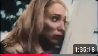 | 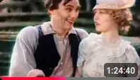 | 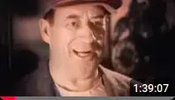 | 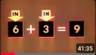 |
| 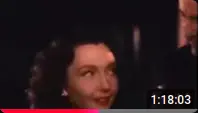 | 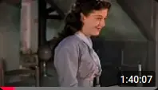 | 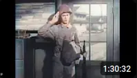 | 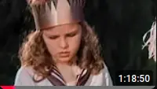 |
| 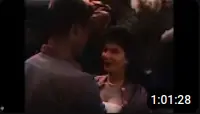 | 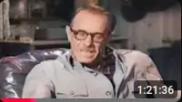 | 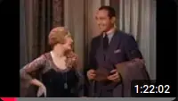 |  |
| 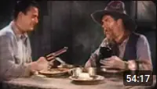 | 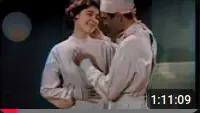 | 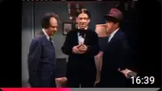 | 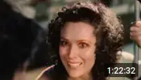 |

