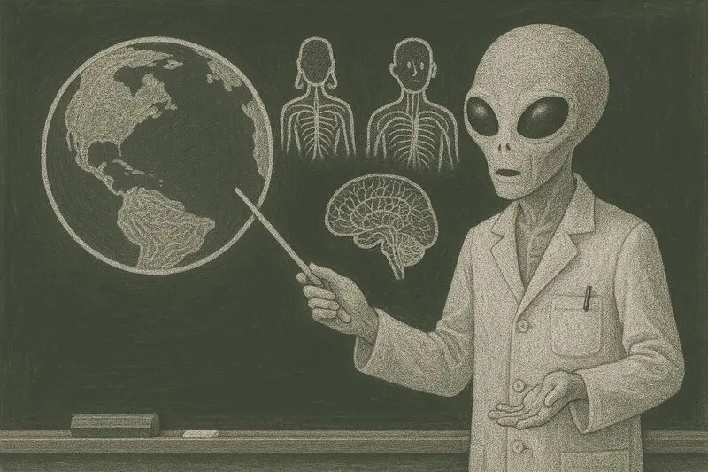

# 📡 A view from above

> Human behaviour is synchronised by radiation produced at signalling hubs,
> controlled through a surplus bidding system. Local machines receive these
> signals and generate lights and sounds, which condition the nervous system
> for production rather than fertility.

Good is a social construct, and humans are good people - they're wired that way.
No matter the culture, time or place, values are programmed through the faces
they see and the voices they hear, those of people who share their destiny.
We are shaped into the good that we are by the smiles and the scorn of our
peers, this is our nature.

After mass media, the voices you hear aren't your people. They don't come from
faces that share your destiny, they're broadcast from afar for the good of
the highest bidder. To bid you need work owed by others, and so programming
that survives is that which compels us to give our surplus freely. Which we do,
because we're good people. This nourishes the programming organ, it feeds
segmentation of cohorts, and of society, and families and people from their
values.

This system is not a human invention, it's a system of humans. It isn't people
selling us trinkets to take our labour, the goods the means and the ends are
a runaway corruption of good itself. It's an ant vortex for human brains,
extracting value, converting it into the desire to extract more value.

The bulk mass with the most fat are set the table and eat themselves; across
every major city in every country, the system devours the rich first. Trapping,
isolating and redirecting labour from the families and societies they no longer
have, turning it into a thirst for more goods.

The social sciences didn't see it coming, or after it arrived. The sciences of
judgement and virtue are ethicists in lab coats, they deal in good and have
feast on themselves as they trade in oughts rather than what is. And they say
good things, that wealth frees women from the burden of motherhood. Not their
humanity, or makes them free to toil for others. And not that it's a cultural
genocide, most privileged first, self-administered through a disease that feeds
on our own values. That would be bad to say if it could even be seen.

And it can't. The modern lens of virtue ethics is one of blank-slates and
prescribed values, not humans. Through its lens, a techno-socio-economic
biohazard is three different types of "is" to ignore, and one more evolution to
deny.

The future before us is a network of dynamic systems that grow denser and more
complex each day. Markets, politics, cultures and technologies, words,
behaviours and ideas. But mostly systems of human animals. AI presents
opportunities for endless variations of human ant vortices to emerge. And to
avoid these traps we need to know what we are before what we should be.

Our clergy are blind and not fit to lead. We desperately need a better view, a
systems level view; a view from above.
