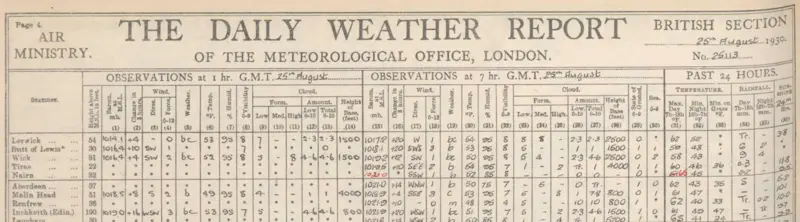

# ⛪ Truth

Before the Internet, nobody knew how old Sean Connery was. You'd read his age in
a magazine, but the journalist hadn't seen his birth certificate. They were just
saying what someone else told them. In 1999 Generation X argued in the pub about
aliens at Area 51 or whether ghosts existed or not, and nobody really knew or
cared. True believers were either mentally unwell, or thought they knew better
because their parents bought an encyclopaedia set from a door to door salesman
for two grand. The final hours of the pre-truth era is one of "Yeah? Well, you
know, that's just like uh, your opinion, man"

Truth with a capital T emerged along with the Internet. Connery was born in
Edinburgh on a damp and breezy Monday evening, three weeks after another wash-out
bank holiday. We know this for a fact, but believe much more through osmosis.

For example, Jimmy Wales unironically believes that Wikipedia is without any sort
of bias. This is typical of people who believe in Truth, as Truth turns out to be
a double-edged sword sans handle. Truthers are as immune to conspiracy theories
as they are vulnerable to actual conspiracies. Rounders are BTFO by thinking
flat-earthers exist as something other than a joke at their expense.

In 2016, Trump's incredible commitment to tradition ushered in the post-truth
era, a brazen Falseness that outraged millennials. Pre-truthers shrugged,
he was just doing what happened through Truth and pre-truth before that, with
less skill. And they can tell when a politician is lying anyway; their lips
move. If given get a chance to adjust before the next epistemology arrives,
post-truthers will hopefully become wise to this. But that's not looking very
likely.

Because it's personal truths that come next. Fractals of mass-manufactured
deceit, individualized, coherent and divisive lies driven by the power of
machine learning. How convenient these truths are, and to whom, will seal the
True fate of the world. Unable to see, we'll just have to wait.
