# Perverse incentives in online dating

A bit ago I posted this Tweet (xeet?), which you can consider a tl;dr:

> Dating apps are a scam. Women choose, so they choose the same guys that
> everyone else does, and they [guys] have loads of options so don't need to
> commit or put any effort in, they like to get laid so make the right noises.
>
> And every successful pairing is a lost customer, so the...
-- bitplane (@bitplane) [August 18, 2024](https://x.com/bitplane/status/1825320262461518319)

After a bit more thought, the problem turns out to be much worse.

## No thanks

I haven't done online dating. I've had a look at it, but never pulled the
trigger on meeting up with a stranger. Seems fucking weird TBH. There's no
pheromones, body language, catching each other's eye, no erosion of personal
space until it's safe to make a move. Turning up to meet a match sounds like a
job interview.

But if you think about it deeper and consider complaints people have about it,
it's a system with structural issues, ones that lead to outcomes that aren't
good for society as a whole.

## A social affair

Let's compare dating someone in your wider social network versus to using a
dating app.

IRL courtship isn't really about two people and everyone else minding their own
business, it's more social than that. Friends and contacts are judgy gossips
with loud opinions and loose lips, they reach a group consensus about a person
that we call their reputation. People talk when peers act badly, damaging that
reputation. So abusive, dishonest or foolish actions come with a reputational
risk, and in turn, the threat of judgement dampens their incentives.

For someone to play matchmaker they have to signal approval of both parties, and
in doing so they put their own reputation on the line - they have skin in the
game. The effect of all this is that the general behaviour of humans is
moderated by the social graph of the participants, nudging it back within the
acceptable norms of their social group and their culture; if people act stupidly
they'll be ridiculed, if they are abusive or dishonest then they'll end up with
no mates.

## ...vs asocial affairs

In contrast, app-driven dates are a secret rendezvous between strangers, and so
they come without reputational risk. That sounds like a positive, but it's the
*threat of social shame* that prevents bad behaviour, without it dishonesty and
foolishness aren't called out, they are excused and even become the norm.

So apps can be used for literal affairs, we end up with tropes like "going
exclusive" rather than, y'know, just not dating multiple people at the same
time, ghosting is practiced and even excused, women fear meeting violent men,
submarines resurface and so on. When actions of bad faith are impossible to
police they become normalized, and we get new memes, worries and justifications
in our vocabulary.

Sure, that's bad, but it's not what I'd call alarming. What is and should be
alarming is that something similar applies to the dating apps themselves. They
have extremely strong incentives to act dishonestly and they control the flow of
information so there's no way for people to catch them doing it; they can do
this in secret while lying about it, and they are in a very strong position to
do so. Essentially, the user's relationship with the app has the same topology
as being in an abusive relationship with a controlling partner.

## The structure of abuse

Let's graph the film *Rita, Sue and Bob Too!*, or at least a grotesque and
oversimplified twisting of it to illustrate the point:

In the above reduction to absurdity, the two schoolgirls are weakly connected as
they aren't being honest with each other, shown by the weak bidirectional
connection. Bob has power of experience and wealth, he's older and has a car,
shown by the strongly connected power dynamic arrow. Through that power
structure, Bob can seduce and impregnate them both; it's Bob's fault, but it's
possible due to the shape of the network.

Let's consider one of the many ways it could be made safer, though with less
black comedy and a bit more slapstick:

In this sanitized version that has a nonzero chance of being made today, Rita
and Sue are more honest and open. Sue talks to her dad, who knows Bob and will
punch his lights out before he gets chance to act inappropriately towards the
girls.

The point is that abuse and control in relationships often involves willing
participants, and such relationships arise naturally due to power imbalances and
limited information flow, shown as a node exerting power over isolated or weakly
connected ones. Power imbalances naturally exist for all kinds of reasons (like
strength, intelligence, beauty, wealth, status, connections, values...), and
people's behaviour stabilizes at a point of balance. The flow of desires and
actions -- of giving a fuck and doing something -- mean that when harm is
threatened or delivered to a well connected node, reputational damage will flow
through the network, eroding the bad actor's social power and restoring balance.

Meeting someone through a mutual friend exists as part of this sort of system,
a graph made of communication channels - communication can be words, body
language or even physical; from an information theoretical point of view a fist
in the face is just another form of communication.

Let's try a slightly more complex, but equally false example constructed to
shove my shitty idea further down your throat:

In this offline version, Mary and John are introduced by Mr and Mrs Duff based
on their reputations and compatibility. Ted and Mrs Doyle don't object, and for
better or worse, they find the person they deserve and live domestically ever
after. Sure it's an abusive relationship, but at least it's *mutually* abusive.
In this version, Mary can't publicly date Pat because everyone knows what he's
like. If she did then John wouldn't go near her, and the Duffs wouldn't
recommend her either.

For most of our history, human mating has taken part in a social system similar
to the simplification above, with good pairings and healthy relationships being
stable systems within a complex, interconnected communication network.

Compare this to the shape of a dating app:

Hmm... That's about as abuse-enabling as a social graph can possibly be.

All the daters are isolated from each other and are only connected to Binder
(pronounce it "binned her" or "binder" depending on your preferences). This
gives it a power dynamic equivalent to keeping users in cages, introducing them
to selected inmates and letting them choose when to open the cage doors.

But they're on your side, right?

Well, Binder has a strong financial incentive to make recommendations that
benefit its shareholders, and its board have a *legal obligation* to increase
profits. As for its users, it only has to provide them with a service - whether
the service is good for them is a matter of opinion. And they provide dates,
as a bare minimum. Successful long-term matches result in a type of user loss
that app developers refer to as "churn", which goes against their legal
obligation. Churn is to service companies as the unsubscribe button is to
YouTubers; and so love is kryptonite to dating apps, it harms them in a way that
might not cause a shareholder lawsuit, but any competent exec will work to
minimize it.

But they don't need to do it on purpose, human nature is hackable.

In our graph above, Pat's bad reputation and John's good one are hidden, so Mary
can only judge on attractiveness. Who they're dating is also hidden, so they can
date multiple people without penalty. Like every woman on Craggy Island, Mary
wants Pat's hairy babies, but she has no good reason to not leave John hanging
as a backup. As gatekeeper to communication, Binder's secrecy ensures nobody can
leak info that Pat's a player so she'll get pumped and dumped like everyone
else. And so John ends up strung along by both Mary and Binder, which Binder is
free to introduce her to a string of enticing but similarly bad matches.

When Pat goes cold on Mrs Doyle (as he's now spending time with Mary), and she
matches with John (who is a single man and swiped right on everything with a
vagina), there's nobody to tell Mrs Doyle that John is out of her league and it
won't last. So of course he ends up boning her; he's not really into her but
he's lonely because all the women on his level are (temporarily) doing better
than him, plus a shag's a shag. Mrs Doyle is in the same situation as Mary, she
has her own orbiters but prefers Pat and John, in that order, and she gets to
keep neither of them.

Binder keeps taking money from John, gathering data and improving the algorithm
that keeps the place busy and converts more people into paying customers. This
means grooming women to become serial daters, and throwing crumbs to the men who
pay to meet them. Once all the value has been milked from their loins, only then
does it make economic sense to encourage them to settle.

This probably doesn't need special effort, people will learn eventually. But
it's also pretty safe. Being a weak match, having bruised hearts, human pair
bonding emotions eroded by algorithmic abuse, any couple is experienced in and
has little fear of romantic failure. Combined with a history of secret liaisons
and a phone book full of previous casual partners, they're bound to be back
soon anyway.

## The Blinding Matchmaker

As for Binder's reputation, that's not at risk because it's not something that
is organic. Like with all products and services (and people with enough capital)
it's delivered by marketing companies. Their power over reputation looks like
like this, but at scale:

```mermaid
graph TD;
    Binder == "😀" ==> Fadwords;             linkStyle 0 stroke:green
    Fadwords -- "😀" --> You;                linkStyle 1 stroke:green
    Fadwords -- "😀" --> Me;                 linkStyle 2 stroke:green
    Fadwords -- "😀" --> Us[Our Friends];    linkStyle 3 stroke:green
    Fadwords -- "😀" --> Us[Our Friends];    linkStyle 4 stroke:green
    Fadwords -- "😀" --> Us[Our Friends];    linkStyle 5 stroke:green
    Fadwords == "😀" ==> Them[Other People]; linkStyle 6 stroke:green
    Fadwords == "😀" ==> Them[Other People]; linkStyle 7 stroke:green
    Fadwords == "😀" ==> Them[Other People]; linkStyle 8 stroke:green

    Us -- "😀" --> You;                      linkStyle 9 stroke:green
    Us -- "😀" --> Me;                       linkStyle 10 stroke:green
    Them == "😀" ==> Us;                     linkStyle 11 stroke:green
    Them == "😀" ==> Us;                     linkStyle 12 stroke:green
    Them == "😀" ==> Us;                     linkStyle 13 stroke:green
    Them == "😀" ==> Us;                     linkStyle 14 stroke:green

    You -. "🤬" .-> Us;                      linkStyle 15 stroke:red
    Me  -. "🤬" .-> Us;                      linkStyle 16 stroke:red

    Us -- "😀" --> You;                      linkStyle 17 stroke:green
    Us -- "😀" --> You;                      linkStyle 18 stroke:green
    Us -- "😀" --> Me;                       linkStyle 19 stroke:green
    Us -- "😀" --> Me;                       linkStyle 20 stroke:green
```

You can't shout back at an advert, it puts its view into the minds of everyone
around you and they exert pressure on you too. So Binder spends some profit on
marketing, marketing spins a yarn about how this is the best way to find love,
and the ad companies shape opinion through the half-truths and gaslighting that
their customer is paying good money for. That's the structure of mass media in
general (not [just marketing, Bill](https://youtu.be/tHEOGrkhDp0); today it's
all trapped dollar), this is business as usual.

This sounds like a pretty horrible reality, and of course I'm exaggerating
somewhat to make a point. Maybe it's alarmist or I'm just plain wrong. But the
financial incentives and network topologies are a thing, so maybe it's also a
lot closer to the truth than most are willing to admit.

## Fixing financial incentives

We can't really solve the structure of abuse itself, but the incentive to abuse
is an economic one. A commitment to building, monitoring and maintaining a more
socially responsible incentive structure would be ideal, but that'd mean the
current owners' mouths writing a cheque that future ones trousers can't cash.

I think there's two main ways to tackle the problem:

1. A public awareness campaign that makes it common knowledge that unless dating
   apps are held to their claims, they will not help users find love.
2. A dating app that actually makes more money from long-term relationships than
   from people seeking a partner.

### Corporate shame is securities fraud

Once corporate bad behaviour is pointed out and everyone knows about it, not
acting to fix it affects share prices, and like everything, everywhere it
[becomes securities fraud](https://www.bloomberg.com/opinion/articles/2019-06-26/everything-everywhere-is-securities-fraud).
Unfortunately I don't have the reach to raise awareness, but maybe someone who
reads this does.

### Mating over dating

A competing app with angle of relationship and family management, where the
first step in the journey is actually starting one, would be almost certainly
guaranteed to not have a pathological effect on relationships. By including
social features, it might even have positive effects on society as a whole.

If the money flows in over a longer period of time, by, say, using affiliate
marketing for dates, weddings, baby products, buying a home and so on, and this
profit is greater than the money made for matching people, then the rest will
follow suit.

## Addressing application-level pathologies

The incentive model isn't the only thing that's broken. There's a 

### Promoting honesty

Remove the secret liaisons and ability to date multiple people, for people who don't want that. Have the app partner with businesses who facilitate dates, offering discounts.

After being matched with someone for X amount of time or number of dates, it's pair up or fuck off - they're either mutually excluded but can see each other's profile, or they're marked as in a relationship and lose access to the dating side of the app - they enter the couples pool for social things.

### Losership bias and the promiscuous pool

### Stalking game theory

### More than pictures

Use semi-anonymous chat as a filter rather than just using pictures, and a limited number of introductions.

### Removing losership bias

Use account age and number of matches as part of the recommendation algorithm. So a promiscuous pool forms, people get locked into it and don't spoil it for everyone else.

### Relationship counselling

Train AI on what actually works, along with which attitudes promote longevity and happiness, and use it to advise couples.

### Divorce cascades

Dampen social connections between couples who are on the rocks, as divorce tends to cascade through friendship groups and families. Don't isolate them, but insulate others from them, specially those who are on the edge.
