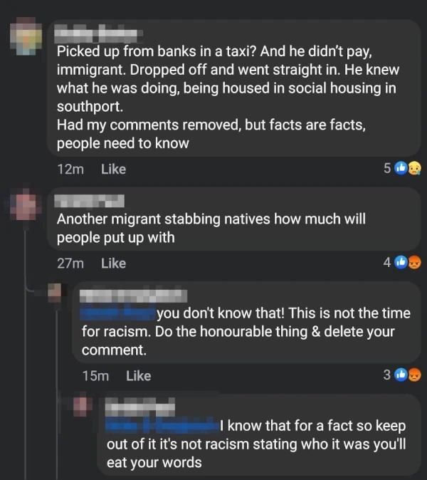

# The Southport Incident

It's been a year since the unthinkable happened, so I'm writing this to reflect
on it and for future reference. This is a personal tech blog, so expect personal
opinion, unfounded hypotheses mixed with observations about narrative building
techniques.

## Proximity

Southport is a Victorian seaside town with a population of 100k, it has a
similar vibe to Llandudno but with fewer Welsh people, less heroin and twice as
many scousers, and it's a place that I've called home for 37 years. We've got
arcades and a fair, a lake, art gallery, a fine selection of boozers, as much
ice cream as you can eat, and extremely strong competition for fish and chips.

I love this town, and literally put it on the map - tracing satellite images of
roads for openstreetmap, and driving round every street for Mapillary to get the
street signs. I've also got a 10 year old daughter and friends with kids the
same age, and I used to volunteer for the NCT.

As the whole world knows by now, on Monday 29th of July 2024, the start of the
second full week in the summer holidays, a couple of dance teachers were
running a Taylor Swift themed party for 3-12 year olds at Hart Space (a
community centre near Bridge St Café). The event was fully booked, with around
25 children present. At around 11:30, 17 year old Axel Muganwa Rudakubana, one
spiteful and vindictive cunt, bunked a taxi to the event from his family home in
Old School Close in (new) Banks, carrying a knife. After refusing to pay his
fare and threatening the driver, he barged into the event, and in a vile act of
senseless brutality, butchered 3 innocent little girls, injured 5 others and
3 adults.

Two of the deceased went to my daughter's school, two of the injured girls
live on the next street. I won't go into details here, but although none of my
immediate friends or family were involved, this is a small town and many friends
of friends were. Fuck that piece of shit.

## Shock, tears, anger

Back in the early days of the web I used to browse ogrish.com and rotten.com,
and I thought I was completely desensitized to shock. But when WhatsApp
delivered the news it hit like a gut punch, I actually had to sit down. This
might be because I'm getting soft in my old age but it's probably because my
girl goes to these sort of things, and it's so close to home; she could have
been there.

As an ordinary man the only evidence of me having tear ducts is weeping at happy
endings, I don't think I can actually cry for myself. And I can't actually
picture a small child being wounded in my head, I don't have a frame of
reference. So when I think about what happened, it isn't the injury and
death that flashes through my mind, it's the contrast. One moment the chatter of
kids playing and laughing, being clumsy and loud in a way that'd be annoying if
it wasn't cute, then that joy is shattered by the most horrible fear and
distress imaginable, the confusion, the loss of innocence. That actually makes
me well up, which was a new experience for me.

And the sadness. Dwelling on the sadness makes me angry. I can do angry, but
this is Very Angry. The sort of anger that makes me think in this case, the
North Korean approach of putting 3 generations of a criminal's family in a
concentration camp is absolutely justified. The same sort of anger that had dads
from High Park driving round looking for the murderer's police car, an anger
that would have led to his death if they'd found him[1]. And if I was that way
inclined, the sort of anger that could be channelled towards the social division
and racial hatred that erupted in the aftermath.

That's what this post is about, the anger. And also gossip and curiosity, it's
about what a riot look like, and how people don't trust the establishment
because they are liars and everyone knows it.

## Information control and flow

In the hours after the attack, our local Facebook news and crime groups had
shifted from shoplifting and lost bikes and were totally focused on the
situation.

BBC News were posting occasional updates, this being the main source of official
news. Other sites were copies of statements by the same lying cunts, so added no
value at all. This is what information control looks like.

Facebook groups had members who were posting context and details, but were then
deleted mostly for reasons to do with respect or decorum:

1. An innocent post asking what all the sirens were about, before there was any
  knowledge of the incident, became a hub of information. But Facebook had
  auto-inserted a ridiculous beaming cartoon face along with the question, and
  as the situation became clear and grim, people demanded that it was removed
  because it was disrespectful.
2. Comments stating that the murderer was an immigrant were attacked for racism
  and removed. The removals were part of the above but also in other threads.

It's impossible to know whether they were reported to Facebook by well-meaning
users, whether the establishment had a team on information suppression duty
there too. We can't tell whether it was the group admins or Facebook themselves,
or some combination of of the above. But the effect is the same. Conversations
about the killer's identity were silenced, information was suppressed. People
knew this and were suspicious and frustrated by it. One example of a removed
comment:

People were sharing links and screenshots of deleted social media posts through
WhatsApp and presumably other channels. This included a photo of heavy police
presence at an address in Banks which turned out to be the killer's home. Later
on, it turned out that images of injured children were shared. These ended up on
4chan.org, who, true to form, tried to maximize upset by posting them for
Southport residents to see.

After declaring a major incident, the police locked down the air space to
restrict drones and press helicopters. This was in effect until after dark, and
enforced by police circling over the town. This is what a major incident
means in the information age, complete lock down of the narrative.

The taxi driver who took the murderer to the destination did not speak to other
taxi drivers for at least the rest of the day. He was presumably kept
unavailable as part of efforts to restrict information. Other witnesses did not
engage in gossip, so they were likely kept under lock and key too. This strategy
was highly effective but resulted in an information vacuum.

One dad whose children escaped unharmed was told by them that the murderer was
an immigrant. He posted the following on LinkedIn:

Direct links to the post resulted in a 404 error, and links to his profile did
the same. Whether this is LinkedIn being shit or part of their suppression
strategy is not known, but it's highly suspect and IMO means LinkedIn, like all
social media websites pretend to have free speech but have systems in place to
limit the reach of information. The post itself was not removed until after it
became apparent that it was a catalyst for riots.

In an information vacuum caused by censorship, any info true or false becomes
highly valued and transmittable. While the Internet in 2024 is largely
controlled by authorities, the surface area is large and the population
fragmented enough that there are gaps.

`x.com` allows all kinds of speculation posted as truth. This is, IMO, fair
enough. People should be allowed to be wrong on the Internet. But if it's the
only source of information and the government and their media mouthpieces are
lying gobshites then that's what's amplified.

A fringe news site that uses copypasta from social media rumours, took some bait
and posted an article that the murderer was a Muslim migrant called Ali who
arrived by boat 12 months earlier.

The photo of the address in Banks had the same car there several years ago, so
I personally managed to find the address and figure out that it was bollocks
with half an hour of effort. The fact that the press didn't is either because
they weren't allowed to, or are incompetent and corrupt. What sort of
self-respecting "journalist" bows down to the establishment when a truth could
prevent civil unrest? The sort that lie on their behalf every day.

Make no mistake. The aftermath is the fault of an D-notice happy establishment
and a press that has no credibility whatsoever.

## The state of the nation

Having [sterilized and used up their peasants worldwide](/~/doc/thoughts/media),
rich countries have imported foreign labour from abroad. Two weeks earlier,
riots had erupted in 

## Strategies of the far right

* Some notes about

## 

## Summary

1. The establishment, politicians and the police are liars.
2. The UK does not have a free press, and everyone knows it.
3. A riot is fun, and very human.
4. We have enough scum of our own without inviting genocidal rapebabies into our
   country.
5. Kier Starmer is a speccy four eyed cunt.
6. Axel Muganwa Rudakubana is the the literal poster child of the BBC, and their
   finest spokesperson since Sir Jimmy Savile.
7. More people died in the aftermath than the establishment will ever let you
   know.

## Timeline

* 19:37 to 20:39 - [Live Stream](https://youtu.be/FHzcX4CIZN0)
  * [Romans 12:19](https://youtu.be/FHzcX4CIZN0?t=1242) sign
* [Live stream](https://youtu.be/GPxJLqf3edI) including drone footage of the riot van being burned.
  
first journalist assaulted: https://youtu.be/GPxJLqf3edI?t=1013
  
second journalist assaulted: https://www.foxnews.com/media/journalist-brutally-assaulted-while-covering-southport-protests-england-police-initially-refused-help

## Two tier Kier

## 🦶🗒️

[1]: I have first hand information that this was happening 2 hours after the
  attack. Thankfully they didn't find the car, not for the murderer's sake, but
  for the families of men who would act justifiably rashly in the case of 100%
  guilt.
